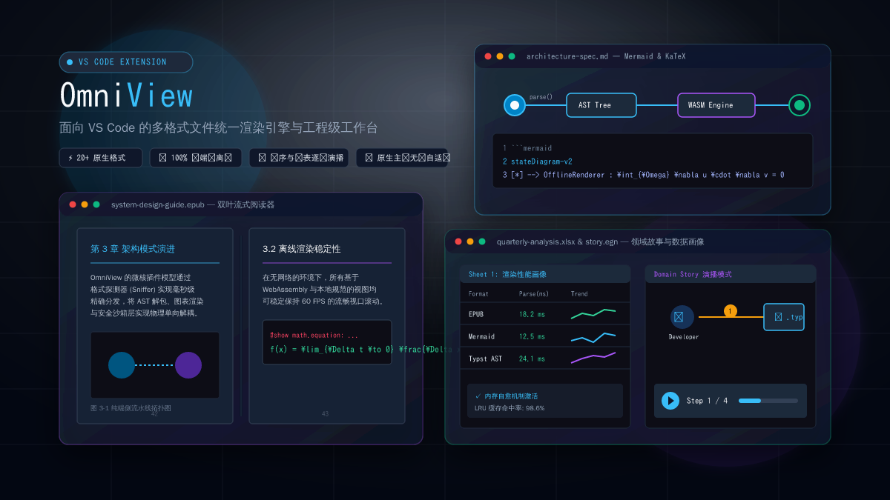

# OmniView

[中文](./README.md) | **English**

<p align="left">
  <a href="https://marketplace.visualstudio.com"></a>
  <a href="./LICENSE"></a>
  <a href="./docs/architecture.md"></a>
  <a href="#"></a>
  <a href="#"></a>
  <a href="#"></a>
  <a href="./CONTRIBUTING.md"></a>
</p>

> **OmniView** is a high-performance, multi-format visualization workbench and VS Code extension for modern document workflows. Built with React 19, TypeScript, Vite 6, and Tailwind CSS v4, it follows the philosophy of **turning data into immersive windows and simplifying complex layout**—covering documents, diagrams, mind maps, vector design, data grids, paginated readers, cloud-native manifests, and structured configuration files.

<p align="left">
  <a href="https://ais-pre-3kity5ft64rqesjejxmxsu-168296143482.us-east1.run.app"><b>⚡ Web Live Demo (No Install Needed)</b></a> ·
  <a href="https://github.com/your-org/omniview/releases"><b>📦 Download VSIX Package</b></a> ·
  <a href="./docs/architecture.md"><b>📖 System Architecture Specification</b></a> ·
  <a href="https://github.com/your-org/omniview/issues"><b>💡 Feedback & Feature Requests</b></a>
</p>



---

## 💡 Why OmniView?

Stop installing a dozen fragmented, heavy extensions that demand subscriptions! OmniView leverages a unified microkernel architecture to deliver **21+ formats out of the box, 100% offline security, pixel-perfect VS Code theme matching, and rock-solid 60 FPS scrolling**.

| Dimension / Pain Point | Vanilla VS Code | Fragmented Standalone Extensions | **OmniView** |
| :--- | :--- | :--- | :--- |
| **Supported File Formats** | Plaintext & syntax coloring only | Requires 8–12 separate extensions | **21+ formats out of the box** (Cloud-Native, TOML, Office, PDF, EPUB, Typst, Diagrams, Mindmaps, Whiteboards, Data) |
| **Network & Privacy Security** | Offline | Often relies on remote servers or paywalled APIs | **100% pure client-side offline**, zero cloud telemetry, automatic secret masking |
| **Office Trio (DOCX / PPTX / XLSX)** | Not supported | Heavy external runtimes required | **Pure in-memory OOXML decoding**, multi-sheet tabs, column profiling, and vector slide playback |
| **Markdown Copy to Word / WPS** | Black boxes, broken images, collapsed styles | Manual image saving and re-inserting | **Proprietary dual-channel clipboard pipeline**, vector diagrams rasterized to 300+ DPI PNGs |
| **Host Theme Harmony** | Native | Inconsistent UI designs across plugins | **100% aligned with `--ov-*` and VS Code design tokens** |
| **Large Document Memory & Framerate** | Good | Heavy diagrams cause severe frame drops | **Lazy-viewport unmounting (`LazyViewportBlock`) & FNV-1a incremental diffing** |

### 🎯 Three Critical Pain Points Solved

1. 📋 **"Copying technical documents into Word without breaking layouts"**  
   Deep-cleaning clipboard pipeline eliminates Tailwind borders and floating handles, converts code blocks to native 2-column Word tables, and rasterizes Mermaid/PlantUML/Graphviz into 300+ DPI inline images.
2. 🚀 **"Effortlessly opening DOCX specs, PPTX slides, and XLSX workbooks right inside the editor"**  
   Pure client-side OOXML extraction; XLSX features multi-sheet switching, column profiling, and sparklines; PPTX supports vector 16:9 / 4:3 slide projection.
3. 🌲 **"No more manual parsing of giant JSON or Kubernetes/Compose configs"**  
   Instant one-click projection into interactive mind maps and service dependency topologies with automated secret masking.

---

## Feature Matrix

### 1. Structured Data Studio
For **JSON, YAML, TOML, and XML**, OmniView goes beyond plain-text viewing with multi-projection visualization:
- **Interactive Tree View**:
  - Smart type color mapping (String / Number / Boolean / Null / Object), item-count badges, and depth connectors;
  - Expand all / collapse to root, structure-aware live search over keys and values;
  - **KeyPath inspector**: click any node to resolve and copy a standard JSONPath (e.g. `$.services.web.ports[0]`).
- **Mindmap Projection**:
  - Zero-config uplift of deep nested structures into an interactive SVG mind map;
  - Unlimited pan/zoom, graded fold/expand, outline navigation, and high-res SVG export.
- **Homogeneous Array Drill-down (Table & Chart)**:
  - Auto-detect root or first-level homogeneous object arrays (e.g. `cluster_nodes`, `items`, `users`) and open an interactive table;
  - Sticky headers, multi-mode sorting, full-text filter, and one-click bar/line micro-charts.
- **Cloud-native Topology View**:
  - Detect Docker Compose / microservice fields such as `services`, `depends_on`, `ports`, and network flow;
  - Auto-generate a clear service-dependency topology.
- **Secret Masking**:
  - Heuristic engine for fields like `password`, `token`, `secret`, `jwt`, and `api_key`;
  - Toggle between masked mode (hover to peek) and plaintext—safe for screen sharing and demos.
- **Offline Format Converter**:
  - Bidirectional live conversion across **JSON ⇄ YAML ⇄ TOML ⇄ XML**;
  - Pretty / compact output, copy or download converted files;
  - **100% local in-memory serialization**—no network requests.

### 2. Enhanced Markdown Rendering Engine
- **Multi-engine diagram matrix**:
  - **Mermaid.js**: flowcharts, sequence diagrams, class/state diagrams (stateDiagram / stateDiagram-v2 with full dark/light adaptive contrast and text invisibility guards), Git graphs, Gantt, C4, and more;
  - **PlantUML**: architecture / sequence / component diagrams with preview ↔ source dual-mode hot render and private server URL config;
  - **Graphviz / DOT**: native ````dot```` / ````graphviz```` fenced blocks via `@hpcc-js/wasm-graphviz` offline WASM + Web Worker;
  - **SVG driver**: inline ````svg```` blocks and local relative `.svg` references, with dark / grid / light backgrounds;
- **KaTeX math**:
  - Inline `$E=mc^2$` with currency false-positive filtering (e.g. `$100`, `$5.99`);
  - Block equations such as `$$\int_{-\infty}^{+\infty} e^{-x^2} dx = \sqrt{\pi}$$`;
  - Direct ````math```` / ````katex```` / ````latex```` academic blocks;
- **Interactive data tables**:
  - Sticky headers and horizontal scroll wrappers for wide tables;
  - Cell-level rich Markdown (inline code, badges);
  - Smart sorting: string, numeric, unit-aware (`128MB` vs `2GB`, `15ms` vs `1.2s`), and datetime;
  - Numeric-column chart sniffing (bar / line);
  - Copy table content; export as CSV or Markdown.
- **Image & diagram lightbox**:
  - Fullscreen or double-click lightbox for images and diagrams;
  - Smooth `0.2x ~ 5.0x` wheel zoom, pan, 90° rotate, copy, and lossless download;
- **Incremental Re-rendering & Dynamic Viewport Unmount (Zero CLS)**:
  - **FNV-1a Block-Level Memoization**: Reuse stable block object references by line range and hash during partial edits or selection formatting, preventing whole-tree recalculations;
  - **Unloadable Viewport Memory Management**: Heavy diagrams (Mermaid, Graphviz, KaTeX, wide tables) automatically unload outside viewport buffer distance to free DOM and WASM memory, backed by global height cache for **Zero CLS**;
- **Selection Bubble Toolbar & Safe Writeback Contract**:
  - Reliable formatting for bold (`**B**`), inline code (`` `C` ``), hyperlinks (`Link`), and bidirectional wiki links (`WikiLink`);
  - Pre-checked with line numbers and contextual text fingerprints to reject silent mis-edits;
- **Render Time Budget & Slow Block Observability**:
  - Monitored millisecond render budget (800ms threshold) with fallback source cards and outline `ZapOff` warning badges;
- **RenderErrorBoundary**:
  - Block-level isolation—broken diagram syntax shows a diagnostic card with fix hints while the rest of the document stays interactive;
- **Outline & search**:
  - Physical heading DOM mounting ensures **100% accurate** outline jumping;
  - Collapsible multi-level TOC with scroll-spy;
  - Keyword search with hit highlighting.

### 3. Mindmap Studio
- Native `.markmap`, `.mm`, `.mindmap`, `.km` with live bi-directional sync;
- Code / split / immersive mindmap modes with 30:70, 50:50, 70:30 presets and free resize;
- Markdown shortcut templates and keyboard support (Tab / Shift+Tab indent, Enter continues hierarchy);
- Zoom, fit-to-view, and high-res SVG export.

### 4. SVG Studio
- Split graphics/code, graphics-only, and code-only modes;
- **Element pick & tweak**: position, size, fill, stroke, radius, opacity, and rotation;
- **Free transform**: 8-handle resize, proportional scale, grid snap, canvas align;
- **Layering**: bring forward / send backward (to front / to back);
- **Developer exports**: reverse jump to source line, SVGO cleanup, React JSX / Vue 3 / Base64 Data URI export.

### 5. EPUB Modern E-book Reader Studio
- Native `.epub` modern e-book reflowable rendering and unpacked reading;
- **Three Flow Modes**:
  - **Two-Page Spread**: CSS Multi-Column simulated book layout with 3D spine creases, paper drop-shadows, and narrow screen responsive fallback;
  - **Single-Page Flow**: Elegant centered column with hover navigation hotspots and arrow key/spacebar shortcuts;
  - **Continuous Scroll**: Vertical smooth reflowable reading with automatic chapter bottom triggers and progress tracking;
- **3D Page Flip Effect**: GPU-accelerated 3D page flip animation with lighting transitions, toggleable at any time;
- **Typography & Reading Progress Persistence (`epubSettingsStorage`)**: Instant persistence for font size (A-/A+), font family (Serif, Sans, Kai, Mono), first-line indent, alignment (justify/left), line height (1.5x/1.75x/2.0x), page width (720px/960px/100%), eye-care themes (Auto, Sepia, Light, Dark), and book-specific reading progress (chapter, page, percentage).

### 6. Modern PDF Reader
- Mozilla PDF.js v4+ binary parse + Canvas rendering;
- **Three layouts**: continuous flow, single-page, dual-page book view;
- **Reading awareness**: scroll-spy progress, lazy viewport rendering;
- **Annotate & search**: cross-page search highlight, outline bookmarks, selection highlights with Markdown export, PNG snapshot, and print.

### 7. Excalidraw Whiteboard Studio
- Native `.excalidraw` hand-drawn diagram file format support;
- **Four view modes**: interactive canvas studio, dual-pane split, read-only SVG preview, and JSON source editor;
- **Self-healing data pipe**: built-in `sanitizeExcalidrawElements` and `restoreElements` to repair invalid element schemas and prevent canvas crashes;
- **Starter templates & export**: 8 architecture and flowchart templates with high-res SVG, PNG, and `.excalidraw` JSON export.

### 8. Typst Academic & Publishing Studio (A4 2.0)
- Pure client-side AST compiler for `.typ` and `.typst` files;
- **Publishing-grade typography**: Outline TOC, physical page breaks, multi-page continuous SVG flow, KaTeX math, and CJK text-width overlap prevention;
- **A4 2.0 print engine**: Dynamic header/footer macro variables (`{{page}}`, `{{totalPages}}`, `{{title}}`, `{{date}}`), alternating gutter margins for bookbinding, and `@page` rules.

### 9. Jupyter Notebook (.ipynb v4) Studio
- Client-side offline parser and renderer for Jupyter Notebook v4 format;
- Markdown narrative cells, syntax-highlighted Python code cells, execution counters, rich multi-format outputs, and ANSI traceback coloration;
- One-click export to standard Markdown (`.md`) or executable Python script (`.py`).

### 10. CSV / TSV Smart Grid
- Lightweight RFC 4180 parser with quoted escapes, multi-line cells, and ragged-width normalization;
- Fuzzy filter, multi-column sort, pagination, stats overview, and export.

### 11. Google OKF (Open Knowledge Format) Cards
- Native recognition of `.okf` files and Markdown Frontmatter OKF headers;
- Extracts Knowledge ID, version, tags, and summary into structured knowledge cards.

### 12. Word (.docx) High-Fidelity Document Viewer
- Client-side offline OOXML rendering via `docx-preview` with A4 paper simulation and continuous flow;
- 50% ~ 200% smooth zoom, merged table cells, borders, shading, multi-level numbering, images, and headers/footers;
- Classic paper, sepia eye-care, and dark mode color inversion with one-click print and PDF export.

### 13. PowerPoint (.pptx) Vector Presentation Workbench
- Offline OOXML shape and asset unpacking with 16:9 / 4:3 auto-scaling vector stage;
- Fullscreen immersive slideshow (F5 / play button), keyboard navigation (`←` `→` / Space / PageUp / PageDown);
- High-res slide thumbnail outline drawer and speaker notes drawer.

### 14. Excel (.xlsx / .xls) Multi-Sheet Spreadsheet Workbench
- **Client-Side Offline OOXML Engine**: Instant unpacking for multi-sheet tabs, SharedStrings pool, formula computed values, and hidden sheets;
- **Smart Data Grid**: Toggle first-row headers / column letters, global search with highlight, column sorting, cell copying, and pagination;
- **Data Profiling & Sparklines**: Real-time type inference, min/max/quartile distribution analysis, and embedded SVG sparkline trends;
- **Multi-Format Export**: Export active worksheet to CSV, TSV, JSON, or Markdown tables with one click.

### 15. Modern ImageViewer & Pixel Inspector
- **Universal Format Support**: Native handling for `.png`, `.jpg`, `.jpeg`, `.gif`, `.webp`, `.bmp`, `.ico`, `.avif`, `.tiff`;
- **10% ~ 3200% High-Precision Zoom**: Crisp pixelated rendering when zoomed in >= 200%, smooth panning, and auto-fit;
- **16x Pixel Crosshair Loupe & Color Sampler**: Floating HUD tracking cursor coordinates `(X, Y)` with live `HEX`, `RGBA`, and `HSLA` sampling, single-click copy;
- **Quad-Mode Canvas Background**: Transparent checkerboard, pure dark room, pure white paper, and native VS Code theme;
- **Geometric Transforms & Export**: 90° clockwise/counterclockwise rotation, horizontal/vertical flip, copy Base64 Data URI, and download original;
- **Deep EXIF Metadata Extraction**: Image dimensions, megapixels, aspect ratio, file size, and camera exposure parameters (aperture, shutter, ISO, focal length).

### 16. Domain Storytelling & egon.io Native Studio
- **Multi-syntax lossless support**:
  - Native parsing for official WPS egon.io `.dst` (JSON) schema, `.egn` extensions, and standalone `.domainstory` files;
  - Markdown deep typesetting integration: ````domainstory````, ````story````, ````dst````, and ````egn```` fenced DSL blocks plus single-line stream syntax;
- **Domain topology & actor relationships**:
  - Auto-renders Actors (person, system, group), Work Objects (document, data, package, email, etc.), and numbered activity arrows;
  - Boundary group zones with adaptive heuristic layout;
- **Interactive step-by-step playback & Polyglot export**:
  - Integrated `DiagramStepPlayer` for step-by-step animation, forward/backward navigation, and spotlight focus;
  - Export official `.dst` files and **Polyglot SVG** with embedded domain model for lossless bi-directional extraction.

### 17. Preferences & Workspace Persistence
- **Central settings hub (`settingsStorage.ts`)**: `v2` keys with seamless legacy migration;
- **Hard clamps**: zoom (0.5~2.5x), font size (12~22px), and split ratios to keep UI stable;
- **Workspace lifecycle (`fileStorage.ts`)**: remember sidebar/explorer state, tab order, and last opened file;
- **Storage analytics & backup**: LocalStorage usage stats, export/import workspace JSON, factory reset.

---

## Quick Start

### Local development

```bash
# 1. Install dependencies
npm install

# 2. Start the Webview dev server (port 3000)
npm run dev
```

### Build & package the VS Code extension (VSIX)

```bash
# 1. Run full verification gates + build
npm run verify

# 2. Package offline VSIX
npm run package:vsix

# 3. Install into local VS Code (keep version in sync with package.json)
code --install-extension omniview-1.0.28.vsix --force
```

After install, right-click a supported file in the Explorer and choose **“Open with OmniView File Renderer”**, or use **“OmniView: Open Side Preview”** from the editor toolbar.

---

## Docs & Collaboration

| Doc | Description |
|---|---|
| [`docs/README.md`](./docs/README.md) | Documentation index |
| [`docs/architecture.md`](./docs/architecture.md) | Layering & render pipeline |
| [`CONTRIBUTING.md`](./CONTRIBUTING.md) | Dev setup, gates, and PR flow |
| [`SECURITY.md`](./SECURITY.md) | Vulnerability disclosure |
| [`CHANGELOG.md`](./CHANGELOG.md) | Release notes |

---

## Example Files

Ready-to-open samples live under [`examples/`](./examples) (see [`examples/README.md`](./examples/README.md)):

| Example | Highlights |
|---|---|
| [`mermaid/omniview-render-pipeline.mmd`](./examples/mermaid/omniview-render-pipeline.mmd) | Standalone Mermaid render-pipeline flowchart |
| [`plantuml/cloud-topology.puml`](./examples/plantuml/cloud-topology.puml) | Standalone PlantUML microservice sequence topology |
| [`graphviz/cloud-architecture.dot`](./examples/graphviz/cloud-architecture.dot) | Standalone Graphviz cloud digraph |
| [`markmap/system-architecture.markmap`](./examples/markmap/system-architecture.markmap) | Standalone Markmap capability map |
| [`diagrams.md`](./examples/markdown/diagrams.md) | Mermaid, PlantUML, SVG, and Graphviz / DOT showcase |
| [`math-formulas.md`](./examples/markdown/math-formulas.md) | KaTeX calculus, linear algebra, physics, attention formulas |
| [`graphviz-diagrams.md`](./examples/markdown/graphviz-diagrams.md) | Layered digraphs, undirected topology, error recovery |
| [`consensus-algorithms.md`](./examples/markdown/consensus-algorithms.md) | Raft / PBFT / PoW-PoS state machines and sequence diagrams |
| [`technical-guide.md`](./examples/markdown/technical-guide.md) | Engineering mixed docs—architecture diagrams, code, tables |
| [`stability-stress-test.md`](./examples/markdown/stability-stress-test.md) | Broken diagrams, missing images, ultra-wide tables, error isolation |
| [`domainstory/ecommerce-fulfillment.dst`](./examples/domainstory/ecommerce-fulfillment.dst) | Standalone official WPS egon.io `.dst` e-commerce fulfillment domain story |
| [`markdown/domain-storytelling.md`](./examples/markdown/domain-storytelling.md) | Markdown embedded Domain Storytelling DSL pipeline case |

---

## License

Released under the [MIT License](./LICENSE). Feedback via [Issues](https://github.com/fsyyzz/OmniView/issues); see [CONTRIBUTING.md](./CONTRIBUTING.md) to contribute.
