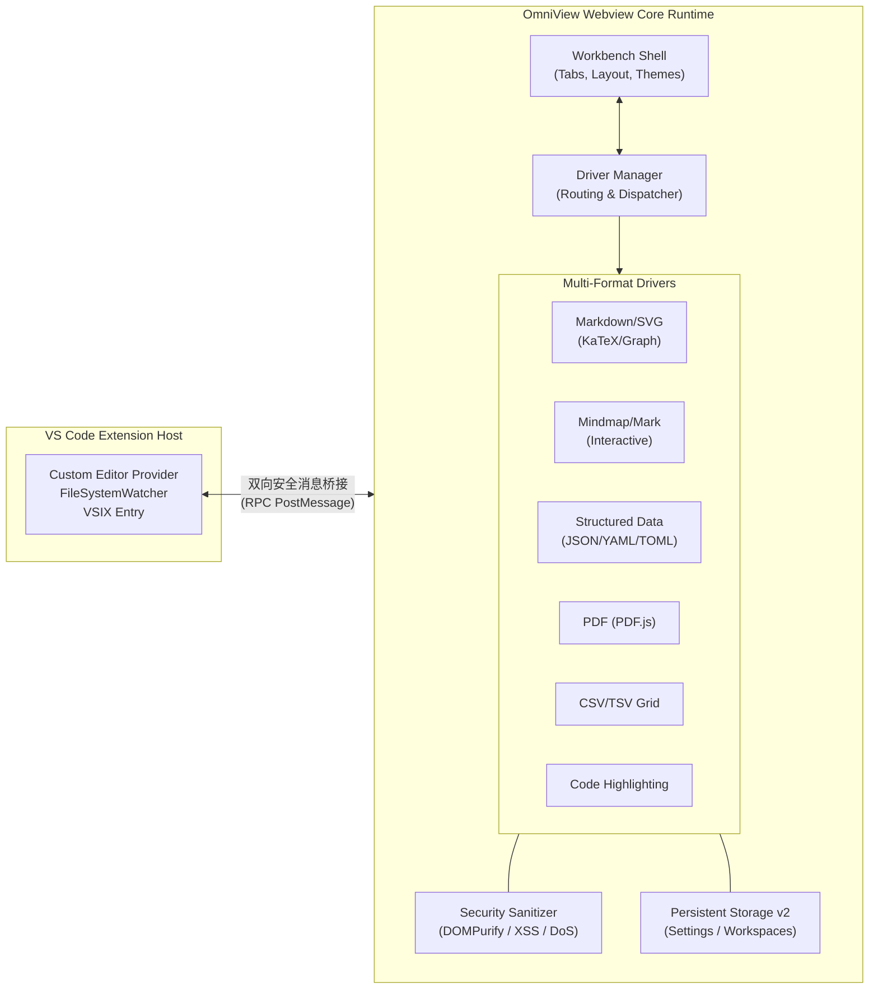

# OmniView

> **OmniView** 是一款面向 VS Code 场景与 Web 现代工作流的高性能、全格式多维文件可视化工作台与插件。基于 React 19、TypeScript、Vite 6 与 Tailwind CSS v4 构建，秉承“**把数据升维为视窗，让排版化繁为简**”的哲学，提供从文档、图表、思维导图、矢量设计、数据网格、版式文档到结构化配置的全景沉浸式渲染能力。

---

## 🌟 核心功能矩阵 (Feature Matrix)

### 1. 结构化数据全景可视化工作台 (Structured Data Studio)
针对 **JSON、YAML、TOML、XML** 格式，拒绝同质化纯文本卷入，原生提供“多态立体投影”能力：
- **交互式层级结构树 (Tree View)**:
  - 智能类型色彩映射（String/Number/Boolean/Null/Object），带数组/对象项数徽标与层级深度连接线；
  - 支持一键展开全部/折叠至首层，支持针对 Key / Value 的结构感知全文实时检索；
  - **KeyPath 路径检视器**: 点击任意节点自动解析并复制标准 JSONPath（如 `$.services.web.ports[0]`），排查定位提效十倍。
- **全景思维导图投影 (Mindmap Projection)**:
  - 零配置将深层嵌套结构无损升维为层次分明的交互式矢量思维导图；
  - 支持无限平移缩放、节点分级折叠展开、快捷大纲导航与高清 SVG 导出。
- **同构数组智能下钻 (Array to Interactive Table & Chart)**:
  - 自动嗅探根节点或首层同构对象数组（如 `cluster_nodes`、`items`、`users`），一键无缝下钻至交互式数据表格；
  - 表格原生具备吸顶表头、多态排序、全文过滤与**一键升维为柱状/折线微图表**能力。
- **云原生服务依赖拓扑图 (Topology View)**:
  - 自动检测 Docker Compose 或微服务编排中的 `services`、`depends_on`、`ports` 与网络流向；
  - 自动生成清晰的微服务依赖调用拓扑架构图，调用链路一目了然。
- **敏感密钥脱敏防护 (Secret Masking)**:
  - 内置智能安全特征引擎，自动探测 `password`、`token`、`secret`、`jwt`、`api_key` 等敏感字段；
  - 一键在【脱敏遮罩】（悬浮临时查看原值）与【明文模式】间丝滑切换，投屏分享、会议演示与截图绝对杜绝密钥泄露。
- **跨格式离线无损互转工作台 (Format Converter)**:
  - 支持在 **JSON ⇄ YAML ⇄ TOML ⇄ XML** 之间双向实时互转；
  - 支持美化缩进 (Pretty) 与紧凑压缩，支持一键复制代码或直接下载转换文件；
  - **100% 本地内存序列化**，不发起任何网络请求，确保企业核心配置绝对安全。

### 2. 深度增强型 Markdown 排版与渲染引擎
- **多引擎图表矩阵集成**:
  - **Mermaid.js**: 支持流程图、时序图、类图、状态机图、Git 提交历史图、甘特图、C4 架构图等；
  - **PlantUML**: 支持架构图、时序图、组件图，支持【可视化预览 / 源码编辑】双向热渲染与私有服务地址配置；
  - **Graphviz / DOT**: 原生支持 Markdown 内嵌 ````dot```` 与 ````graphviz```` 代码块，基于 `@hpcc-js/wasm-graphviz` 离线 WebAssembly 引擎与 Web Worker 异步计算；
  - **SVG 矢量图驱动**: 支持内联 ````svg```` 代码块与本地相对路径 `.svg` 引用，支持深色/网格/浅色背景切换；
- **KaTeX 数学与科学公式**:
  - 行内公式 `$E=mc^2$` 与货币价格防误触正则过滤（如 `$100, $5.99` 不被识别为公式）；
  - 块级多行对齐方程组 `$$\int_{-\infty}^{+\infty} e^{-x^2} dx = \sqrt{\pi}$$`；
  - 支持 ````math````、````katex````、````latex```` 代码块直接高保真学术排版；
- **交互式数据表格增强 (Interactive Data Table)**:
  - 自动为所有 Markdown 表格注入吸顶表头与平滑横向滚动容器，杜绝超宽破坏排版；
  - 单元格富文本 Markdown 混合排版，支持行内代码与徽标渲染；
  - **多态智能排序**: 支持字符串拼音/字母排序、纯数值大小排序、带单位数值排序（如 `128MB` vs `2GB`、`15ms` vs `1.2s`）与标准日期时间排序；
  - **列图表化潜能嗅探**: 自动识别数值序列并生成实时柱状图或折线图可视化；
  - 支持表格内容一键复制、导出为标准 CSV 或格式化 Markdown 文本。
- **沉浸式图片/图表灯箱 (Image & Diagram Lightbox)**:
  - 正文图片与图表支持一键全屏或双击快速唤起灯箱；
  - `0.2x ~ 5.0x` 鼠标滚轮平滑缩放、放大拖拽平移 (Pan)、顺时针 90° 旋转、一键复制与无损下载；
- **极限稳定性与错误边界 (RenderErrorBoundary)**:
  - 块级精细隔离，单个图表语法损坏局部展示诊断卡片与一键报错修复建议，**文档其他部分 100% 保持交互，绝不白屏**；
- **高交互目录大纲与实时检索**:
  - 可折叠多级大纲目录，滚动联动感知平滑定位 (Scroll Spy)；
  - 关键词全文搜索与命中高亮导航。

### 3. 思维导图专业套件 (Mindmap Studio)
- 原生支持 `.markmap`、`.mm`、`.mindmap`、`.km` 扩展名与双向实时联动；
- 支持【代码编辑 / 分屏对比 / 纯导图沉浸】三种视图模式，提供 30:70、50:50、70:30 黄金分屏预设与自由拖拽调节；
- 内置 Markdown 语法快捷模板、快捷键支持（Tab / Shift+Tab 缩进控制、Enter 自动续行续级）；
- 缩放、居中自适应定位与高清 SVG 矢量导出。

### 4. SVG 交互式矢量工作台 (SVG Studio)
- 支持图形/代码双栏分屏、纯图形视口与纯代码三种模式；
- **可视化图元点选与微调**: 支持图元点选，实时调节坐标、尺寸、填充色彩、描边、圆角、透明度与旋转变换；
- **自由几何变换**: 8 向控制手柄自由拖拽调整尺寸与等比缩放、网格智能吸附与画布快速对齐；
- **图层管理**: 图元层级快速提升/下移（置顶/置底）；
- **开发者导出套件**: 支持图元行号反向代码定位、SVGO 深度净化去冗余、一键生成 React JSX 组件、Vue 3 组件或 Base64 Data URI。

### 5. PDF 现代阅读器 (Modern PDF Reader)
- 基于 Mozilla PDF.js v4+ 内核驱动，支持真实二进制 PDF 解析与 Canvas 高清渲染；
- **三重视图排版**: 多页连续流式瀑布流 (Continuous Flow)、单页居中翻页与双页图书并排开本；
- **阅读感知**: 视口滚动联动阅读进度感知 (Scroll Spy)、视口懒渲染防卡顿 (Lazy Viewport)；
- **批注与检索**: 全文跨页检索高亮、多级大纲书签树、划词高亮批注与 Markdown 格式导出、无损快照 PNG 导出与打印。

### 6. CSV / TSV 智能数据表格与分析
- 符合 RFC 4180 规范的超轻量健壮解析引擎，支持双引号转义、跨行单元格与参差列宽归一化；
- 全局关键字模糊过滤、多列排序、分页浏览、统计概览与数据导出。

### 7. 全局偏好与工作区持久化体系
- **集中式配置中枢 (`settingsStorage.ts`)**: 存储键升级为 `v2`，无缝自动向前平滑兼容迁移旧版本配置并安全回写；
- **严苛边界防护**: 对缩放比例 (0.5~2.5x)、字号 (12~22px) 及分屏比例建立数学截断与钳位容错，避免任何异常值影响交互；
- **多工作区生命周期持久化 (`fileStorage.ts`)**: 记住侧边栏与资源管理器开关状态、活动标签页顺序与最后打开文件；
- **存储用量分析与安全备份**: 实时统计 LocalStorage 占用量与键清单，支持工作区配置导出独立 JSON、校验导入与一键恢复出厂设置。

---

## 🚀 快速开始

### 本地开发预览

```bash
# 1. 安装项目依赖
npm install

# 2. 启动 Webview 本地调试服务器 (运行于 3000 端口)
npm run dev
```

### 构建与打包 VS Code 插件 (VSIX)

```bash
# 1. 运行全量物理门禁与工程构建
npm run verify

# 2. 打包离线 VSIX 插件包
npm run package:vsix

# 3. 安装插件至本地 VS Code 编辑器
code --install-extension omniview-0.9.10.vsix --force
```

安装完成后，在 VS Code 资源管理器中右键任意支持的文件，选择 **“使用 OmniView 文件渲染器打开”**，或在编辑器右上角点击 **“OmniView: 在侧边打开预览”**。

---

## 📂 示例文件目录

OmniView 在 [`examples/`](./examples) 与工作区内置了一套开箱即用的丰富场景用例：

| 示例文件 | 说明与核心展示特性 |
|---|---|
| [`cloud-infrastructure.yaml`](./examples/markdown/diagrams.md) | YAML 微服务拓扑关系、环境变量敏感脱敏、集群节点同构数组下钻表格与格式互转 |
| [`openapi.json`](./src/shared/data/sampleFiles.ts) | 复杂多层 RESTful API 规范，展示 JSONPath 检视、结构树折叠与脑图投影 |
| [`diagrams.md`](./examples/markdown/diagrams.md) | Mermaid、PlantUML、SVG 与 Graphviz / DOT 综合图表对比 |
| [`math-formulas.md`](./examples/markdown/math-formulas.md) | KaTeX 微积分、线性代数、物理学四大方程组与 Transformer 注意力公式 |
| [`graphviz-diagrams.md`](./examples/markdown/graphviz-diagrams.md) | Graphviz 分层微服务有向图、网络拓扑无向图、二叉树与错误降级自愈 |
| [`consensus-algorithms.md`](./examples/markdown/consensus-algorithms.md) | 分布式共识机制 (Raft, PBFT, PoW/PoS) 状态机、时序图与证明公式 |
| [`technical-guide.md`](./examples/markdown/technical-guide.md) | 真实工程级混合技术文档（含架构图、代码块与多态表格） |
| [`stability-stress-test.md`](./examples/markdown/stability-stress-test.md) | 语法损坏图表、缺失图片、20 列超宽表格等极限压测与错误边界隔离 |

---

## 🛡️ 架构设计与安全防御

OmniView 严格采用模块化分层解耦架构，保障在浏览器与 VS Code 沙箱内均具备极高可靠性：



1. **零外网依赖与纯离线安全**:
   - 所有的解析、转换与渲染（包括 Graphviz WASM、KaTeX 公式排版、Markmap 矢量导图与数据跨格式转换）均为纯本地内存执行，不产生任何外部网络传输，杜绝敏感配置泄露。
2. **多层级 XSS 与 DoS 防御**:
   - 经过 DOMPurify 严格白名单过滤与 HTML 实体编码，彻底抵御 SVG、Markdown 和图表中的恶意脚本与 XSS 注入向量；
   - 包含超大字符长度与复杂节点图元数量阈值防护，防止畸形文件诱发 UI 线程死锁或内存溢出。
3. **高健壮容错机制**:
   - 单个图表解析失败自动降级至错误诊断卡片，不影响正文阅读与大纲导航；
   - WASM Web Worker 异常时自动无缝降级至主线程进程内执行，提供极致稳定的阅读体验。

---

## 🧪 自动化测试与质量保障

OmniView 配备全面的单元测试与构建验证：

- **自动化单元测试 (`npm test`)**: 覆盖图表诊断、Mindmap 导图驱动、配置与工作区持久化、CSV/TSV 数据解析、安全 XSS 拦截过滤、驱动路由分发等核心链路；
- **类型检查与构建验证**: 执行 `npm run lint` 验证 TypeScript 静态类型，执行 `npm run build:plugin` 验证扩展包构建产物完整性。

---

## 📄 开源许可证

本项目基于 [MIT License](./LICENSE) 开源。

