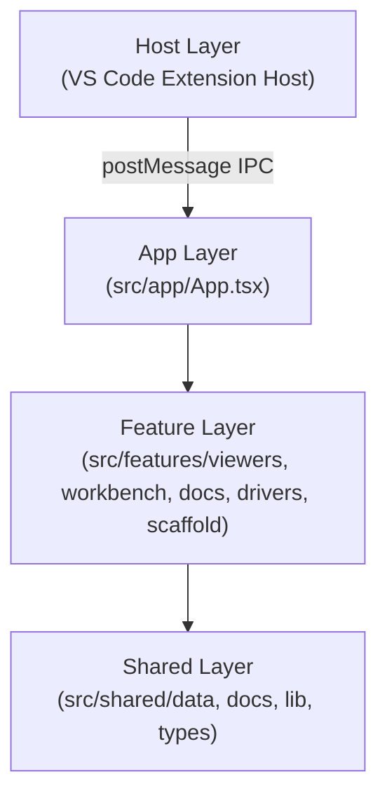
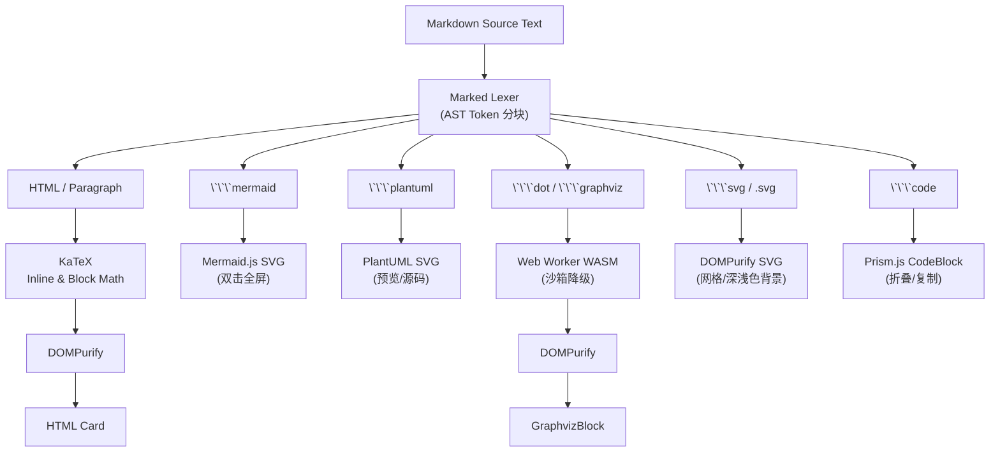

# OmniView 架构设计与系统工程规范

## 1. 架构目标与定位

OmniView 致力于为 VS Code 开发者提供统一、高性能、无缝集成的多格式文件可视化体验。系统兼顾 VS Code Custom Editor Webview 强隔离沙箱运行模式与独立 Web 应用运行模式。

---

## 2. 系统分层与职责划分

整体遵循单向依赖与特性隔离原则：

### 2.1 宿主层 (Extension Host Layer)
- **入口**: [`src/extension/extension.ts`](../src/extension/extension.ts)
- **职责**: 注册 `CustomReadonlyEditorProvider` 与 `omniview.editor`，管理 Webview 生命周期与安全资源根路径（`localResourceRoots`），通过 `FileSystemWatcher` 与 `onDidSaveTextDocument` 监听本地文件变更并向 Webview 投递增量热重载消息。

### 2.2 渲染工作区与驱动分发 (Viewers & Workbench)
- **分发总控**: [`src/features/viewers/ViewerRenderer.tsx`](../src/features/viewers/ViewerRenderer.tsx) 依据文件扩展名智能分发至对应的 Viewer 驱动；
- **独立驱动组件**:
  - `MindmapViewer.tsx` / `MarkmapViewer.tsx`: 基于 Markmap 的思维导图全功能工作台，支持 `.markmap`、`.mm`、`.mindmap`、`.km` 扩展名，双向编辑、大纲/文本/导图实时联动与多比例分屏；
  - `MarkdownViewer.tsx`: 深度增强型 Markdown 解析与块级分发；
  - `CodeViewer.tsx`: Prism.js 多语言语法高亮与行号；
  - `CsvViewer.tsx`: CSV/TSV 交互式数据表格与筛选导出；
  - `PlantUmlViewer.tsx`: PlantUML 架构与时序图交互视口，支持自定义私有渲染服务；
  - `SvgViewer.tsx`: SVG 交互式矢量工作台 (SVG Studio)，支持图形/代码双栏分屏、纯图形与纯代码视口；提供图元点选微调（尺寸/坐标/填充/描边/圆角/变换）、图层置顶/置底、智能吸附对齐、反向代码定位、SVGO 压缩与 React JSX / Vue 3 组件导出；
  - `PdfViewer.tsx`: 基于 Mozilla PDF.js v4+ 的现代化版式阅读器，支持多页连续流式 (Continuous Flow)、单页翻页与双页图书并排开本；集成视口阅读进度感知 (Scroll Spy)、视口懒渲染防卡顿 (Lazy Viewport)、全文检索跨页高亮、划词批注与 Markdown 导出、多级大纲书签与无损打印导出；
  - `TypstViewer.tsx`: 基于轻量纯端侧 AST 编译器架构与 A4 2.0 工业级出版排版引擎的 Typst (`.typ`, `.typst`) 双向分屏工作台 (Typst Typesetting Studio)，支持实时增量编译、KaTeX 矢量数学公式渲染、大纲跳转、瀑布流/单页/双页视图切换、语法片段快捷插入与高精度 A4 矢量打印/SVG 导出；
  - `StructuredDataViewer.tsx`: 结构化数据全景可视化工作台，针对 JSON、YAML、TOML、XML 提供层级折叠树 (Tree)、全景矢量思维导图投影 (Mindmap)、同构数组下钻表格 (Table & 柱状折线微图表)、微服务/Docker 依赖拓扑 (Topology)、敏感密钥脱敏防护 (Secret Masking) 与离线无损跨格式互转 (Format Converter)。

### 2.3 持久化存储与配置层 (Persistence & Storage Layer)
- **配置持久化 (`src/shared/lib/settingsStorage.ts`)**:
  - 全局键名规范化升级至 `omniview:workbench:settings:v2`；
  - 具备旧版 `v1` 数据平滑向上迁移与自愈回写机制；
  - 数值参数安全钳位防护（缩放、字号、分屏比例），杜绝越界脏数据引发界面异常；
  - 存储空间容量分析（`getStorageStats`）、配置 JSON 导出备份与增量合并导入。
- **文件与工作区持久化 (`src/shared/lib/fileStorage.ts`)**:
  - 管理工作区内文件的增删改查、最后激活文档与打开的标签页序列。

### 2.4 Markdown 块级解耦与渲染管道

---

## 3. 安全防护与容错设计

1. **DOMPurify 严格防御**: 所有 HTML、SVG 与 Graphviz 渲染产物必须经过 DOMPurify 白名单过滤，严格禁止 `<script>`、`<iframe>`、`onload`、`onclick` 等内联脚本和恶意协议。
2. **块级错误边界隔离 (`RenderErrorBoundary`)**: 对每个渲染块进行独立隔离，当某单个图表出现严重语法错误或 AST 解析异常时，仅在当前区域降级渲染包含错误摘要与重试按钮的诊断卡片，保证正文、大纲、工具栏及其他图表 100% 正常运行。
3. **Webview 沙箱自愈降级**: 当 Web Worker 在 VS Code Webview 强隔离沙箱中受同源策略限制时，Graphviz 调度器无缝切换至内存异步 WASM 引擎，确保 100% 渲染成功。

---

## 4. 验证与门禁标准

每次迭代必须通过全量物理门禁（`npm run verify`）与单元测试：
- `test`: 9 大自动化单元测试套件（共 66 组用例，覆盖图表诊断修复引擎、思维导图驱动映射、配置持久化体系、RFC 4180 CSV/TSV 解析、安全 XSS/DoS 防护、格式路由与未知降级、SVG 开发者工程工具与转换引擎、Markdown 交互式表格工具链、结构化数据多态视图与转换）；
- `lint:codex`: 规范索引与引用检查；
- `check:structure`: 源码分层与入口检查；
- `check:doc-code-consistency`: 文档事实与代码一致性检查；
- `check:react-governance`: React Hook 依赖治理检查；
- `lint`: TypeScript 静态类型检查 (`tsc --noEmit`)；
- `build:plugin`: Webview 与 Extension 生产构建。