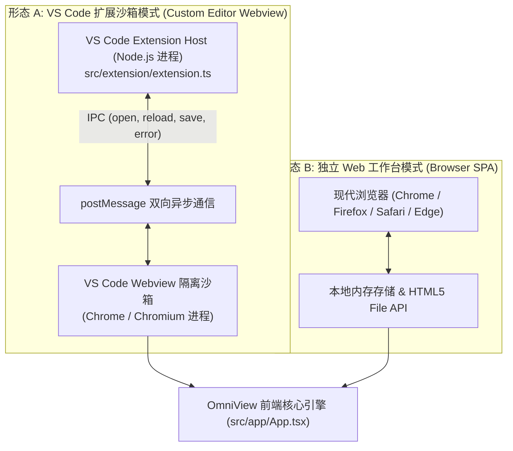
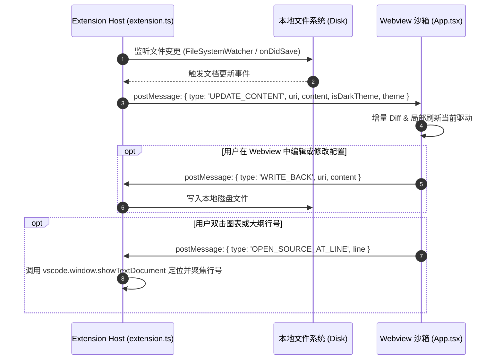
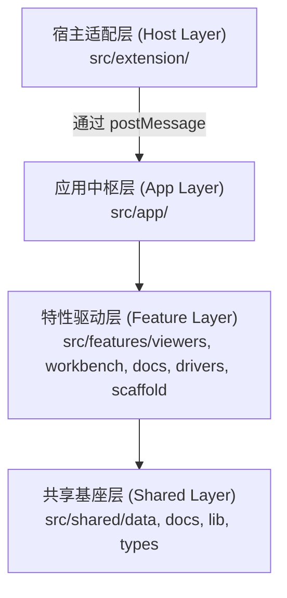
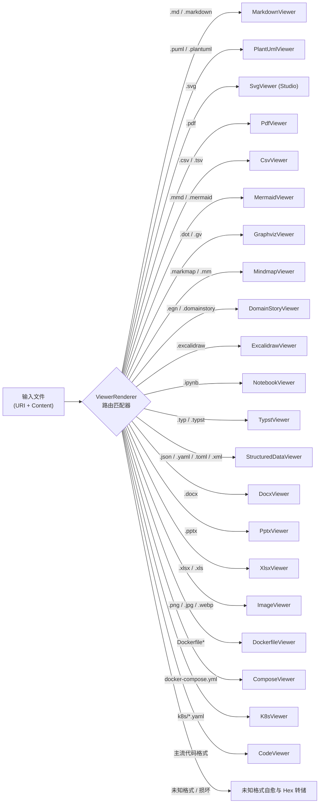
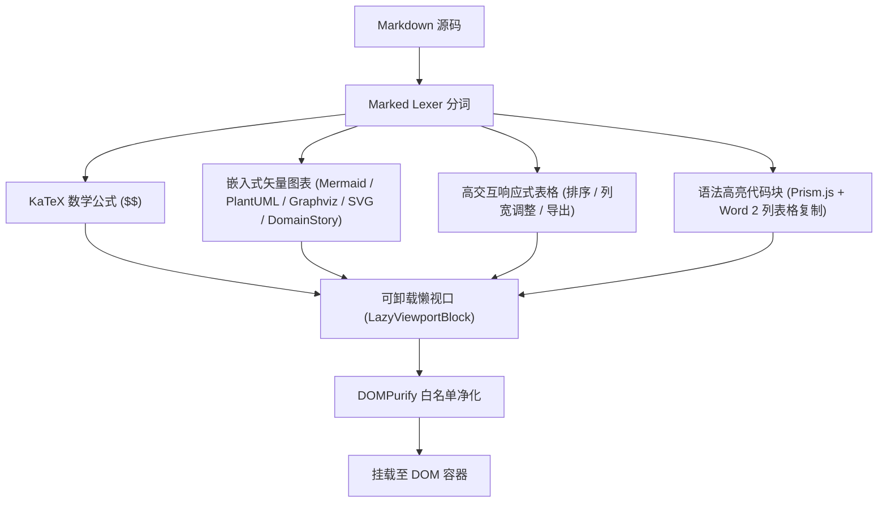

# OmniView 架构设计与系统工程规范 (System Architecture Specification)

> **文档标识:** `docs/architecture.md`  
> **适用范围:** OmniView 全体架构师、核心开发者与开源贡献者  
> **标准状态:** 现行核心架构基准文档

---

## 1. 架构目标与系统愿景

OmniView 致力于为 Visual Studio Code 开发者与现代 Web 工作台提供**多格式、统一化、高性能且零外部依赖**的文件可视化与交互体验。

### 1.1 核心设计哲学
1. **微内核驱动模型 (Microkernel Driver Pattern)**: 核心外壳仅负责布局编排、IPC 通信与状态持久化；各文件格式（Markdown、PlantUML、PDF、Office 三件套等）均封装为具备独立生命周期与错误边界的 Viewer 驱动；
2. **纯前端/离线优先 (100% Offline & Pure Frontend)**: 不依赖任何远端商业付费服务或后台 Node 进程，所有解析、布局运算、WASM 编译与渲染均在客户端沙箱就地完成；
3. **安全纵深防御 (Defense in Depth)**: 全链路实施 DOMPurify 白名单过滤、CSP 强隔离与块级错误隔离，杜绝 XSS 注入与恶意脚本执行；
4. **像素级 VS Code 视觉融合**: 100% 依托 `--ov-*` 语义化设计令牌，无缝吸附 VS Code 宿主原生 CSS 变量及第三方主题（如 One Dark Pro、Dracula、Tokyo Night 等）；
5. **高性能稳帧与低内存占用**: 通过可卸载懒视口渲染 (`LazyViewportBlock`)、脏块指纹增量复用与高度记忆池，在万行长文档与百页书籍中维持 60 FPS 丝滑滚动与低内存开销。

---

## 2. 系统物理拓扑与运行模式

OmniView 原生支持两种物理运行形态，核心渲染逻辑通过抽象层实现 100% 代码复用：

### 2.1 VS Code Webview 通信协议契约 (IPC Protocol)

Extension Host 与 Webview 之间通过标准的 JSON 报文进行双向交互：

---

## 3. 依赖防腐与单向分层架构 (Clean Architecture)

代码库遵循严格的单向依赖拓扑，禁止逆向依赖与跨层穿透：

- **宿主适配层 (`src/extension/`)**: 负责 VS Code Custom Editor Provider 注册、命令挂载、Webview Panel 创建与宿主事件监听；
- **应用中枢层 (`src/app/`)**: 负责应用唯一入口 (`App.tsx`)，解析 URL Query、初始化主题设计令牌、分发全局事件；
- **特性驱动层 (`src/features/`)**:
  - `viewers/`: 18+ 格式驱动核心组件与关联 Hook/Lib；
  - `workbench/`: 工作台外壳、侧边栏、多标签页管理器、状态栏与设置面板；
  - `docs/`: 内置工程规范与技术文档中心 (DocCenter)；
  - `drivers/`: 驱动能力矩阵管理中心 (DriversManager)；
  - `scaffold/`: 扩展脚手架导出中心 (ScaffoldExporter)；
- **共享基座层 (`src/shared/`)**:
  - `lib/`: 配置持久化 (`settingsStorage`)、文件存储 (`fileStorage`)、原生主题 (`nativeTheme`)、打印桥接 (`printBridge`)、i18n 多语言体系；
  - `data/`: 内置示例文件池与 Driver 注册元数据；
  - `docs/`: 编译期嵌入的技术文档数据；
  - `types.ts`: 全局共享 TypeScript 接口与类型定义。

---

## 4. 统一驱动抽象与路由分发总控机制

所有文件通过统一的调度中心分流，根据文件扩展名与内容特征分发至对应驱动：

---

## 5. 核心驱动子系统深度设计

各驱动子系统的详细规范请查阅配套设计文档：
- **格式驱动矩阵与生命周期**: 请参阅 [`docs/design/viewer-drivers.md`](./design/viewer-drivers.md)；
- **Markdown 增量分词与渲染流水线**: 请参阅 [`docs/design/markdown-pipeline.md`](./design/markdown-pipeline.md)；
- **持久化配置与存储子系统**: 请参阅 [`docs/design/persistence-storage.md`](./design/persistence-storage.md)。

### 5.1 Markdown 增强型块级管道 (Markdown Pipeline)

### 5.2 矢量图表引擎与沙箱自愈调度
- **Mermaid.js**: 统一注入主题配置 (`mermaidConfig.ts`)，针对明亮/暗黑主题进行高对比度色值矫正，并包裹双击全屏沉浸灯箱 (`LightboxModal`)；
- **Graphviz DOT**: 采用主线程与 Web Worker 双通道混合调度，在 Worker 失败时无缝自动降级至内存 WASM 执行；
- **PlantUML**: 支持自建私有服务与官方代理无缝切换，提供 300+ DPI 矢量光栅化入剪贴板；
- **Domain Storytelling**: 100% 遵循 egon.io 业务建模规范，支持逐帧步进演播与 Polyglot SVG 双向无损导入导出。

### 5.3 现代排版与电子出版引擎
- **Typst Studio**: 基于纯端侧 AST 增量编译器架构与 A4 2.0 工业级排版引擎，支持实时增量编译、KaTeX 公式混排、多版心切换与高精度 A4 矢量打印；
- **EPUB 现代流式阅读器**: 支持双叶并排跨页 (Two-Page Spread)、单页流式 (Single-Page Flow) 与连续流式滚动 (Continuous Scroll) 三重形态、3D 翻书光效，以及阅读进度断点续读；
- **PDF.js v4+ 版式阅读器**: 支持多页连续流式、划词标注侧栏 (`PdfAnnotationsView`)、Markdown 批注导出、全文检索高亮与视口阅读进度感知。

### 5.4 Office 离线无服务工作台
- **Word (.docx)**: 基于 OOXML 标准与 `docx-preview` 纯前端离线流水线，支持 A4 拟真排版、缩放与夜间对比度反转；
- **PowerPoint (.pptx)**: 纯离线解包与矢量自适应画布，支持 16:9 / 4:3 沉浸放映与演讲者备注；
- **Excel (.xlsx)**: 多工作表毫秒级切换、公式计算值解析、列特征画像分析 (Profiling) 与迷你走势图。

---

## 6. 安全防御矩阵与沙箱隔离规范 (Security & Sandboxing Matrix)

| 防御层级 | 攻击场景 / 风险 | 防护实施策略 | 校验手段 |
| :--- | :--- | :--- | :--- |
| **L1: 输入层** | 超大畸变文件导致内存溢出 (DoS) | 文件体积前置嗅探、流式块解析、数值安全钳位 | `test-security-sanitizer.mjs` |
| **L2: 渲染层** | 恶意 `<script>`、`<iframe>`、`onerror` 属性型 XSS | 强制经过 DOMPurify 严格白名单清洗过滤，阻断所有未授权属性 | `test-diagram-sanitizer.mjs` |
| **L3: 视口层** | 动态内联 SVG 携带恶意外部实体注入 (XXE) | 剥除 `<!ENTITY>` 声明与外链资源引用 | `test-svg-utils.mjs` |
| **L4: 运行层** | 单个图表语法崩溃击垮整个插件工作台 | `RenderErrorBoundary` 块级捕获，就地降级为 DiagnosticCard | `test-diagram-diagnostics.mjs` |
| **L5: 存储层** | LocalStorage 恶意注入篡改配置 | Schema v2 校验、数值越界重置、JSON 异常捕获兜底 | `test-settings-storage.mjs` |

---

## 7. 性能工程与资源回收规范 (Performance & Optimization)

1. **可卸载型懒视口管理 (`LazyViewportBlock`)**:
   - 超长文档中，超出视口保护范围的重型图表自动卸载 DOM 与 WASM 资源；
   - 依赖全局 `blockHeightCache` 记忆节点高度，滚动回视口时瞬间就位，达成零布局抖动 (Zero CLS)。
2. **慢块监控与耗时预算 (`renderTimeBudget`)**:
   - 实时记录单块渲染耗时，超过 800ms 阈值在大纲树显式标红/标黄；
3. **剪贴板 100% 同步流水线**:
   - 拦截复制事件，彻底消除外层 Tailwind 边框与交互手柄，为 Word/WPS 写入 300+ DPI Base64 极清图片与规范 2 列表格；
4. **资源全生命周期回收**:
   - 组件卸载 (`useEffect` 清理函数) 严格执行：
     - 撤销所有动态生成的 Blob URL (`URL.revokeObjectURL`)；
     - 终止 Web Worker 实例 (`worker.terminate()`)；
     - 清除定时器与 ResizeObserver 监听，确保零内存泄漏。

---

## 8. 前置工程质量门禁与全自动化测试架构

OmniView 实施严苛的持续交付门禁，任何代码提交前必须 100% 绿灯通过：

### 8.1 46 组自动化测试套件覆盖矩阵
- **图表与渲染 (12 组)**: Mermaid 配置/状态、PlantUML URL/代理、Graphviz WASM/布局、SVG 工具链、思维导图、Domain Storytelling、Excalidraw 白板、图表诊断、图表步进播放、图表缓存、图表安全清洗、KaTeX 公式；
- **文档与版式 (11 组)**: Markdown 选区替换、Markdown 大纲提取、Markdown 脚注、Markdown WikiLinks、Markdown Callout、Markdown Pandoc 扩展、Markdown 打印导出、Word 富文本剪贴板、A4 打印分页、A4 排版引擎、Typst 排版编译器；
- **现代格式与电子书 (7 组)**: EPUB 流式解析引擎、PDF 阅读与标注引擎、Word DOCX 引擎、PowerPoint PPTX 引擎、Excel XLSX 引擎、现代图像引擎、Jupyter Notebook 离线解析；
- **数据与工作台 (8 组)**: RFC 4180 CSV 解析、CSV 数据画像分析、结构化数据多态视图、Google OKF 知识卡片、DOM 搜索高亮器、双向滚动同步、视口懒加载、历史撤销重做；
- **工程与基础设施 (8 组)**: 驱动路由分发、原生主题自适应、配置持久化与迁移、i18n 国际化字典、打印桥接、版本自动自增、VSIX 产物内容核对、Webview 回写保存。

---

## 9. 文档体系与导航索引

| 文档路径 | 文档名称 | 核心内容定位 |
| :--- | :--- | :--- |
| [`docs/architecture.md`](./architecture.md) | **系统架构设计规范** (本文档) | 全局架构、分层拓扑、IPC 通信、安全矩阵与门禁全景 |
| [`docs/design/viewer-drivers.md`](./design/viewer-drivers.md) | **Viewer 格式驱动设计规范** | 18+ 文件格式驱动能力矩阵、Props 契约与降级自愈 |
| [`docs/design/markdown-pipeline.md`](./design/markdown-pipeline.md) | **Markdown 渲染流水线规范** | 块级虚拟化、增量 Diff、慢块预算与 Word 剪贴板清洗 |
| [`docs/design/persistence-storage.md`](./design/persistence-storage.md) | **持久化与存储子系统规范** | 配置 Schema v2、版本平滑迁移、安全钳位与容量分析 |
| [`docs/README.md`](./README.md) | **技术文档导航总索引** | 文档目录索引与维护准则 |
| [`PROJECT.md`](../PROJECT.md) | **工程现状与产品全景基准** | 项目技术栈、功能全景图与目录架构基准 |
| [`CHANGELOG.md`](../CHANGELOG.md) | **版本变更历史日志** | Keep a Changelog 标准版本演进日志 |
