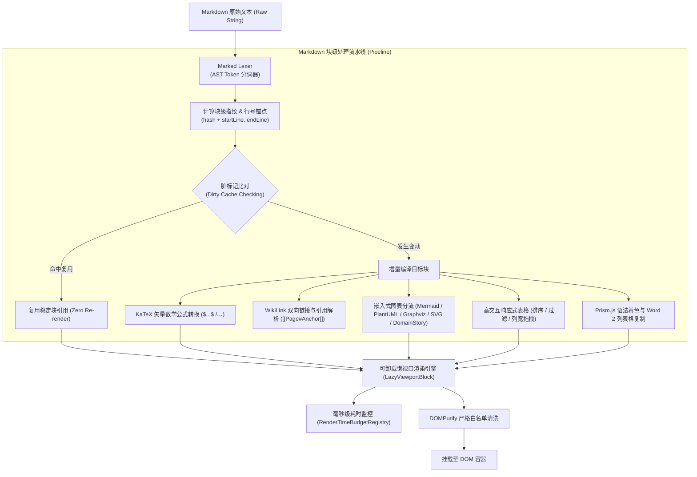
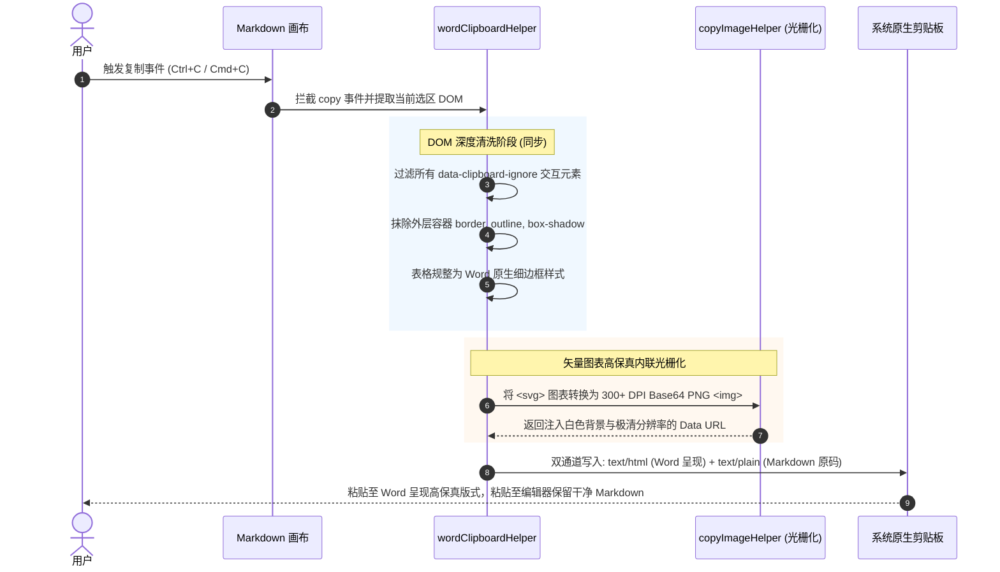

# OmniView Markdown 高性能解析与渲染流水线设计规范 (Markdown Pipeline Specification)

> **文档标识:** `docs/design/markdown-pipeline.md`  
> **所属子系统:** `src/features/viewers/components/drivers/MarkdownViewer.tsx` 及关联 Hook/Lib  
> **标准状态:** 现行核心架构规范

---

## 1. 架构总览与流水线阶段

OmniView Markdown 引擎并非简单的纯 HTML 转换器，而是面向企业级架构文档、学术论文与超长技术规格书设计的**块级虚拟化与增量响应式渲染管道**。



---

## 2. 块级指纹与增量脏标记复用机制 (Incremental Diffing)

为解决长文档（10,000+ 行）因微小按键或划词导致全篇整树卡顿的问题，系统引入 AST 块指纹机制：

1. **唯一块 ID 生成**: 结合块类型、起始行、终止行及文本内容的哈希计算唯一指纹：
   $$\text{BlockFingerprint} = \text{hash}(\text{type} + \text{startLine} + \text{endLine} + \text{rawText})$$
2. **块级引用复用**: 在 React 渲染树中，未发生变更的静态文本段落、高开销图表或表格直接复用上一轮的 React Element 引用，彻底阻断无效的子组件生命周期更新；
3. **行号精确锚定**: 每个 Token 均携带准确的 `startLine` 与 `endLine`，支持双向交互：
   - 预览区双击/选中触发 `onOpenSourceAtLine(startLine)`；
   - 宿主编辑器光标变动触发滚动监听（`useScrollHeadingSpy`）并在大纲树实时高亮当前章节。

---

## 3. 性能预算与慢块监控体系 (`renderTimeBudget.ts`)

为了对重型图表（如含数百个节点的 Mermaid 流程图或庞大 Graphviz DOT 状态机）保持可观测性与系统韧性，引擎内置了实时毫秒级性能监控：

```typescript
export class RenderTimeBudgetRegistry {
  /** 默认单块渲染耗时门限 (800ms) */
  private defaultBudgetMs = 800;
  
  /** 记录单块实际耗时 */
  recordTime(blockId: string, type: string, durationMs: number, startLine?: number, endLine?: number): void;
  
  /** 判断指定行或块是否超时，用于在大纲展示慢块警告徽章 */
  isLineSlow(line: number): boolean;
}
```

- **慢块告警徽章**: 当某个复杂渲染块耗时超过 800ms 时，大纲树中对应章节自动打上黄色性能警示图标，提示作者优化图表结构；
- **异步卸载保护**: 结合 `LazyViewportBlock`，当超长文档中的重型图表滚出视口超过 2 屏时，自动卸载底层渲染实例，将内存归还给浏览器/VS Code Webview，滚动回视口时依据 `blockHeightCache` 高度记忆池瞬间恢复，确保零布局抖动 (Zero Cumulative Layout Shift)。

---

## 4. Word / WPS 剪贴板富文本高保真清洗流水线 (`wordClipboardHelper.ts`)

在企业研发环境中，开发者经常需要将 Markdown 文档（含表格、图表、高亮代码）复制到 Microsoft Word 或 WPS 中汇报。传统复制存在三大行业痛点：
1. 外部图表复制进 Word 出现红叉或空白；
2. Tailwind CSS 类名与多重包装层导致 Word 中充斥多余边框与黑框；
3. 复制时误将悬浮工具条、拖拽手柄、排序按钮等交互 UI 一并复制。

OmniView 通过独创的**同步多通道剪贴板清洗流水线**彻底解决上述痛点：



---

## 5. A4 2.0 工业级出版打印与排版引擎

支持将 Markdown 或 Typst 文档一键编译为工业级 A4 纸张排版：
- **精确厘米级版心**: 严格遵循国家与国际标准 A4 规格（210mm × 297mm，标准边距 25.4mm）；
- **动态跨页断页算法**: 智能探测段落与代码块高度，避免表格或图表在中间被生硬截断（`break-inside: avoid`）；
- **页眉页脚与动态页码**: 自动注入文档标题、生成时间与 `第 X 页 / 共 Y 页` 打印标线。
