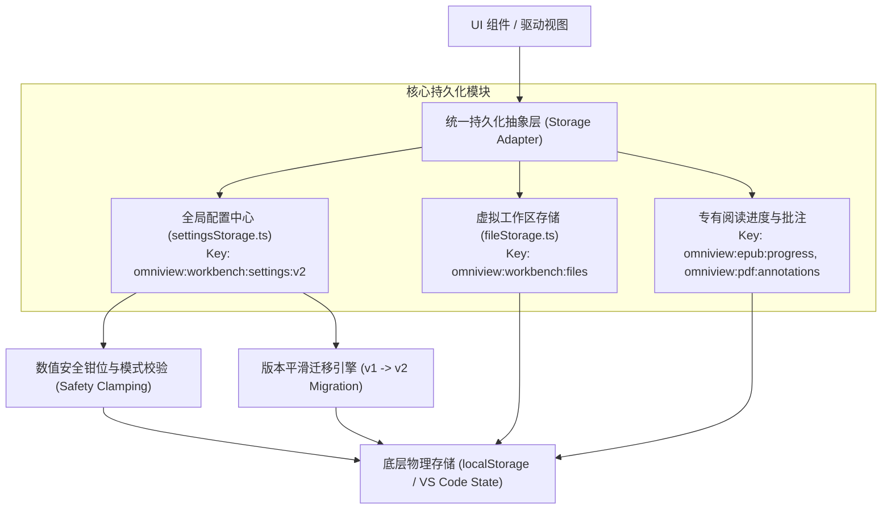

# OmniView 持久化与存储子系统设计规范 (Persistence Subsystem Specification)

> **文档标识:** `docs/design/persistence-storage.md`  
> **所属子系统:** `src/shared/lib/settingsStorage.ts`, `src/shared/lib/fileStorage.ts`, `src/features/viewers/lib/epubSettingsStorage.ts`  
> **标准状态:** 现行核心架构规范

---

## 1. 存储子系统整体设计

OmniView 既运行在独立 Web 端，又运行在 VS Code Extension Webview 沙箱中。持久化层封装了针对浏览器 `localStorage` 与 VS Code 宿主状态 API (`acquireVsCodeApi().setState()`) 的统一兼容适配层。



---

## 2. 全局配置 Schema 规范与演进契约

### 2.1 Settings Schema v2 定义

```typescript
export interface WorkbenchSettingsV2 {
  /** Schema 版本标识 (当前必须为 2) */
  schemaVersion: 2;
  /** 全局主题 ID ('vs-dark' | 'vs-light' | 'github-dark' | 'one-dark-pro' 等) */
  theme: string;
  /** 界面紧凑度 ('compact' | 'normal' | 'spacious') */
  density: 'compact' | 'normal' | 'spacious';
  /** 界面国际化语言 ('zh-CN' | 'en-US') */
  locale: 'zh-CN' | 'en-US';
  /** Markdown 编辑器字号 (安全钳位范围: 10 ~ 32px) */
  fontSize: number;
  /** 默认分屏比例 (安全钳位范围: 0.2 ~ 0.8) */
  splitRatio: number;
  /** 默认缩放比率 (安全钳位范围: 0.1 ~ 5.0) */
  zoomLevel: number;
  /** PlantUML 私有渲染服务器地址 (URL 格式校验，空则回退官方服务) */
  plantUmlServerUrl: string;
  /** 是否启用硬件加速 Canvas 渲染 */
  enableHardwareAcceleration: boolean;
  /** 是否在离开视口时自动卸载重型图表 (内存节约模式) */
  enableLazyBlockUnmount: boolean;
}
```

### 2.2 跨版本平滑迁移与自愈机制 (Migration Strategy)

系统在启动加载配置时，自动检测存储中的版本标志：
1. **若发现旧版 `v1` 数据**（旧 Key: `omniview:workbench:settings` 或无 `schemaVersion` 字段）：
   - 提取用户的语言、主题和自定义配置；
   - 补全 `v2` 新增字段（如 `enableLazyBlockUnmount`、`splitRatio` 等）；
   - 执行参数安全钳位校准；
   - 自动原子化写入新键名 `omniview:workbench:settings:v2`，并安全移除旧键名，完成平滑自愈；
2. **容错兜底**: 若存储数据遭到外部篡改或发生 JSON 解析崩溃，配置加载函数立即回退至内置初始基线（`DEFAULT_SETTINGS_V2`），并在控制台记录预警日志，确保工作台 100% 能够成功启动。

---

## 3. 数值安全钳位规范 (Safety Clamping Boundary)

为防御因异常配置输入（如手动导入损坏的 JSON 配置）导致界面崩溃或排版错乱，所有关键数值在落盘和读出时强制执行物理钳位：

$$\text{fontSize} = \text{clamp}(\text{fontSize}, 10, 32)$$
$$\text{splitRatio} = \text{clamp}(\text{splitRatio}, 0.2, 0.8)$$
$$\text{zoomLevel} = \text{clamp}(\text{zoomLevel}, 0.1, 5.0)$$

---

## 4. 存储容量分析与备份治理 (`getStorageStats`)

存储模块向运维与设置面板暴露度量接口：
- `getStorageStats()`: 实时统计 OmniView 各模块在 `localStorage` 中占用的字节数与百分比；
- `exportSettingsBackup()`: 一键导出纯净安全的 JSON 配置文件；
- `importSettingsBackup()`: 支持增量合并与字段校验的安全导入机制。
