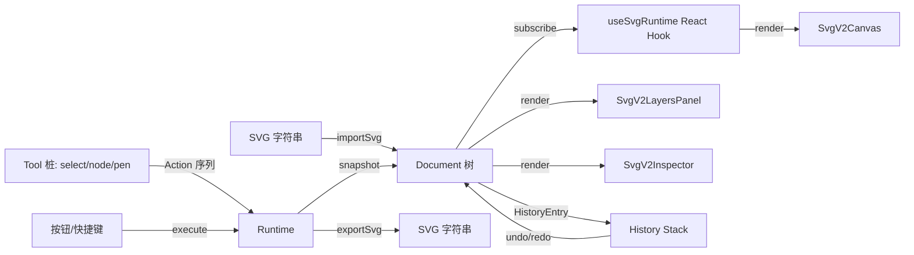

# OmniView SVG v2 编辑引擎设计规范 (SVG Edit Engine v2 Specification)

> **文档标识**: `docs/design/svg-v2-editor.md`
> **所属子系统**: `src/features/viewers/components/drivers/svg/`（v2 部分）
> **关联 ADR**: [ADR-0001 SVG 编辑引擎 v2 — 引入文档模型与命令管线](../adr/0001-svg-edit-engine-v2-document-model.md)
> **标准状态**: 已交付（v1 与 v2 双轨运行；用户通过 `omniview.svg.engine` 切换）

---

## 1. 架构总览

v2 引擎采用「不可变文档模型 + 命令管线 + Tool 状态机」三段式架构，参考 VectorCraft `crates/doc`、`crates/tools`、`crates/engine`：



## 2. 核心数据结构

### 2.1 Document（不可变）

```text
Document
├── canvas: { width, height, unit, viewBox }
├── layers: NodeId[]                    # z-order
├── nodes: Map<NodeId, Node>            # 全量节点
├── nextNodeId: number                  # ID 分配计数器
├── metadata: Record<string, string>
└── _internal: { revision }
```

**结构共享保证**：`updateNode(doc, id, fn)` 仅克隆变化的 entry，其他节点引用保持 === 相等；undo 几乎零成本。

### 2.2 Node 种类

| Kind | 说明 | 关键字段 |
|---|---|---|
| `Layer` | 顶层图层（必有 name/colorTag/visible/locked） | children |
| `Group` | 编组容器 | children + appearance |
| `Path` | 全部几何图元归一化（含 rect/circle/line/polyline/polygon） | geometry + appearance + primitiveHint |
| `Text` | 文本（P1 阶段只读） | text + appearance |
| `Image` | 图片（P1 阶段只读） | href + width + height |
| `Use` | 符号引用（P1 阶段只读） | symbolId |

### 2.3 PathGeometry

```text
PathGeometry
└── subPaths: SubPath[]
    └── SubPath
        ├── anchors: Anchor[]    # M/L/C/Q/A/Z 解码后的控制点
        └── closed: boolean

Anchor
├── point: Vec2
├── handleIn / handleOut: Vec2 | null
└── kind: 'corner' | 'smooth' | 'symmetric'
```

### 2.4 Selection

```text
Selection
├── nodeIds: NodeId[]      # 多选集合
└── primaryId: NodeId|null # 主选中（panel 高亮）
```

## 3. 命令管线 (Commands)

### 3.1 命令注册表

`core/commands/registry.ts` 维护所有命令的 `(id, title, undoLabel, params[], handler)` 描述。共 **34 条** 标准命令：

| 命名空间 | 命令 | 用途 |
|---|---|---|
| `path.*` | `set`, `insertAnchor`, `deleteAnchor`, `close` | 路径几何编辑 |
| `object.*` | `move`, `scale`, `rotate`, `transform`, `group`, `ungroup`, `reorder`, `delete`, `setName`, `setVisible`, `setLocked`, `align`, `distribute` | 图元变换 + 结构 + 显隐锁定 + 对齐分布（`align` 支持 selection/canvas 双基准；`distribute` 首尾不动等距；`reorder`/`layer.reorder` 支持 `toIndex` 供拖拽排序） |
| `paint.*` | `setFill`, `setStroke`, `setOpacity`, `setBlend`, `setAppearance`, `setColor` | 外观 |
| `layer.*` | `add`, `remove`, `rename`, `setVisibility`, `setLock`, `reorder`, `setColorTag` | 图层操作 |
| `select.*` | `box`, `set`, `all`, `clear`, `same` | 选择 |
| `history.*` | `undo`, `redo` | 撤销栈 |
| `tool.*` | `setActive` | 工具切换 |

### 3.2 命令执行模式

每条命令是纯函数 `(doc, sel, params) → CommandResult`：

```ts
type CommandResult =
  | { ok: true; doc; selection; warnings? }
  | { ok: false; error: { kind, commandId, message } };
```

Runtime 调度：
- **Exec**（单步命令）→ 直接落地为 1 条 HistoryEntry；
- **Begin / Preview / Commit**（手势交互）→ Begin 时 snapshot 文档；Preview 在 snapshot 上反复重算；Commit 落地为 1 条 HistoryEntry。

## 4. Runtime 状态机

```text
┌─────────────────┐
│     Idle        │ ← default state
└─────────────────┘
   │ execute(Exec)
   ↓
┌─────────────────┐
│   Commit        │ ─→ write HistoryEntry ─→ back to Idle
└─────────────────┘

   │ execute(Begin)
   ↓
┌─────────────────┐
│  Previewing     │ ─→ execute(Preview) ─→ Previewing (replace prev)
   │
   ├── execute(Commit) ─→ write 1 HistoryEntry ─→ Idle
   └── execute(Cancel) ─→ restore snapshot ─→ Idle
```

## 5. React 集成

### 5.1 useSvgRuntime Hook

```ts
const {
  runtime, document, selection, activeToolId,
  canUndo, canRedo,
  execute, undo, redo, setActiveTool,
} = useSvgRuntime(initialContent);
```

- 内部通过 `runtime.subscribe(setSnapshot)` 订阅状态变化；
- 任何 doc/sel/tool/history 变更自动触发 React re-render。

### 5.2 顶层组件：SvgV2Studio

`SvgV2Studio.tsx` 三栏布局（编排外壳，2026-10 起按大组件阈值拆分）：
- **左**：工具栏（select / node / pen + Undo/Redo + 新建图层）；
- **中**：画布（递归渲染 Layer > Group > Path 树，Group 以 `<g>` 嵌套）；
- **右**：`SvgV2LayersPanel` + `SvgV2Inspector` + 引擎切换器。

**`SvgV2LayersPanel`（`SvgV2LayersPanel.tsx`）— 图层树面板**：
- `flattenLayerTree` 递归展示 Layer/Group 编组树（深度缩进、展开/折叠、子项计数）；
- HTML5 拖拽排序：拖拽推导走 `planReorderDrop` 纯函数 → `layer.reorder(toIndex)`（层间）/ `object.reorder(toIndex)`（同层图元）；跨层拖拽与类型不匹配返回 null（P1 边界）；
- 双击行内重命名（Layer → `layer.rename`；Group/Path → `object.setName`），Enter/blur 提交、Escape 取消；
- 行级显隐（`layer.setVisibility` / `object.setVisible`）与锁定（`layer.setLock` / `object.setLocked`）；
- 落点视觉提示（行上/下半 2px accent 边框）、拖拽源半透明。

**`SvgV2Inspector`（`SvgV2Inspector.tsx`）— 属性检视器**：
- 单选：填充色 + 包围盒/位置/名称 + 删除；
- 多选（≥2）：6 向对齐按钮（选区/画布基准切换）+ 批量填充 + 批量透明度 + 批量删除；
- 多选（≥3）：水平/垂直等距分布按钮；
- 对齐/分布/批量样式全部经命令管线落地，天然支持撤销。

## 6. 持久化与备份

### 6.1 SVG 单一持久化

- import：`fallbackDomParse(svg)` → Document；
- export：`documentToSvgString(doc, opts)` → SVG 字符串（pretty / minimizeIds / omitHiddenLayers）；
- 双轨：浏览器走 DOMParser；Node.js（测试用）走正则 fallback。

### 6.2 usvg-wasm 路径（M1 阶段就绪）

- 路径：`scripts/build-usvg-wasm.mjs` 检测 Rust toolchain；
- toolchain 缺失时自动回退 DOMParser；
- 产物落地 `public/usvg-wasm/`，Vite 静态服务，Worker 懒加载。

### 6.3 自动备份

- 切到 v2 引擎后，**首次修改**时把原 SVG 内容（含 `[omniview-v2-engine]` 标记）落 `*.bak.svg`；
- 仅首次切换写备份，后续编辑不再落盘；
- 备份由 `core/backup.ts` 提供 writeBackup 接口（VS Code webview 端通过 postMessage 桥接）。

## 7. Feature Flag

```text
omniview.svg.engine = 'v1' | 'v2'    # 默认 'v1'
```

- `core/featureFlag.ts` 提供 getSvgEngineFlag / setSvgEngineFlag；
- `SvgViewer.tsx` 入口检查 flag，命中 v2 走 `SvgV2Studio`；否则走原 v1 路径；
- v2 引擎 UI 右下角引擎切换器可实时切换（reload 页面生效）。

## 8. 测试覆盖（97 用例 / 全过）

| 测试套件 | 用例数 | 覆盖 |
|---|---|---|
| `test-svg-v2-core-model.mjs` | 19 | Document 工厂 / 增删 / 结构共享 / Selection / 几何变换 / path d 编解码 / fuzzing |
| `test-svg-v2-runtime-commands.mjs` | 21 | Runtime 基础 / execute / Action 序列 / undo+redo / 编组解组 / 删除 / 错误路径 / Tool dispatch / export / fuzzing |
| `test-svg-v2-e2e.mjs` | 12 | SVG round-trip / 编辑往返 / 撤销栈 / 异步边界 / 8 样例 fuzzing / 综合工作流 / Feature Flag / Backup |
| `test-svg-v2-wheel-zoom-fix.mjs` | 18 | 滚轮缩放防误触契约：属性面板/批量面板/状态栏/UI 控件内的 wheel 不触发画布 zoom，画布上 wheel 正常缩放 |
| `test-svg-v2-layers-batch.mjs` | 27 | 几何纯函数（transformRect/nodeBBox/alignDelta/distributeOffsets）/ object.align 双基准 / object.distribute / setVisible/setLocked / 图层树 flatten+折叠 / 拖拽推导 planReorderDrop（层间+同层+跨层拒绝）/ toIndex 端到端 / 编组子节点去重 |

## 9. 已知边界与未来工作

### 9.1 P1 当前未覆盖

- 文本 `<text>` 编辑（只读）
- 图片 `<image>` 编辑（只读）
- Symbol / Use 编辑（只读）
- Pattern / Mask / ClipPath 烘焙（保留原始属性，浏览器渲染层处理）
- 滤镜（filter）编辑（只读）
- 真正的弧线近似（A 命令简化为直线）
- 图元跨层拖拽（`planReorderDrop` 跨层返回 null，仅支持层间拖拽与同层内图元拖拽）
- 分布仅支持选区基准（首尾不动等距；画布基准分布为 P2）

### 9.2 后续 P2/P3 路线

| 阶段 | 内容 |
|---|---|
| P2 | 钢笔 / 直接选区（节点+手柄拖拽）；形状工具（矩形/椭圆/多边形/星形/线段/弧/螺旋/网格）；渐变面板；外观面板 |
| P3 | 路径查找器（布尔运算）；画笔；宽度工具；实时效果 |
| 远期 | MCP 命令表面；多格式导入导出（PDF/AI/EPS） |

## 10. 验收清单（ADR §7 对齐）

- [x] `npm run lint:codex` 0 错误
- [x] `npm run check:structure` 0 反向依赖、0 循环
- [x] `npm run check:doc-code-consistency` 通过
- [x] `npm run check:react-governance` 通过
- [x] `npm run lint` (`tsc --noEmit`) 0 错误
- [x] `npm run test` 全过（97 个 SVG v2 测试 + 既有 364 个）
- [x] `npm run build:plugin` 0 错误
- [x] `npm run verify` 综合门禁：**416 ✅ / 0 ❌**
- [x] Round-trip：编辑 → export → import 关键图元保持一致
- [x] 撤销 100 步 + 重做 100 步结构共享保持稳定
- [x] Feature Flag 默认 v1，可切到 v2 实验引擎
- [x] 8 个真实 SVG 样例（含 rect/circle/line/path/g/text/stroke）全过 fuzzing
- [x] 异步边界：连续 10 次 loadFromSvg + 失败注入均不破坏 runtime
- [x] 备份策略：首次切到 v2 时落 .bak.svg