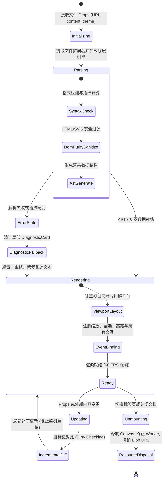
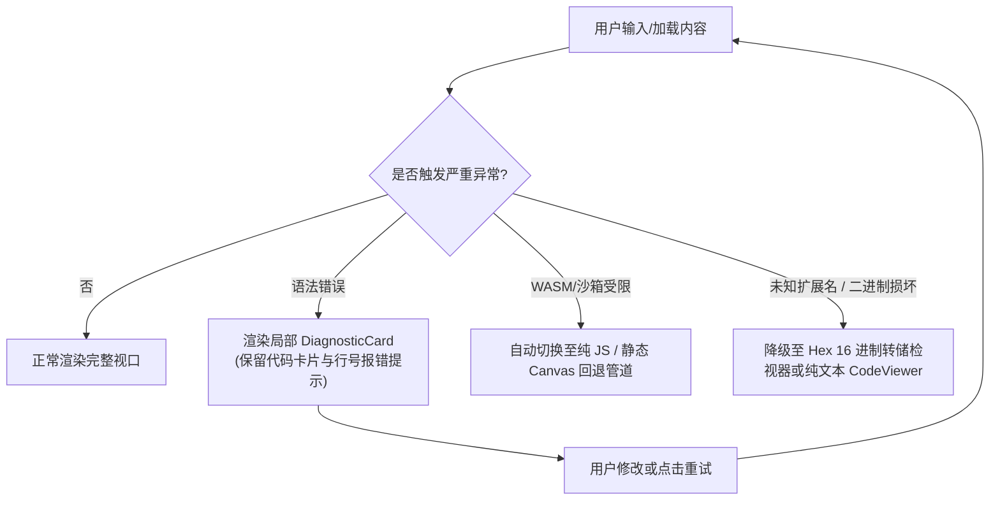

# OmniView 文件格式驱动架构与设计规范 (Viewer Drivers Design Specification)

> **文档标识:** `docs/design/viewer-drivers.md`  
> **所属子系统:** `src/features/viewers/`  
> **标准状态:** 现行核心架构规范

---

## 1. 驱动矩阵全景概览

OmniView 采用轻量化、按需加载的微内核驱动架构。整个系统由统一的驱动调度总控（`ViewerRenderer.tsx` 与 `driverRouting.ts`）统一负责文件类型识别、扩展名感知、MIME 嗅探与降级兜底。

### 1.1 驱动能力支持矩阵

| 序号 | 驱动模块名称 | 支持文件扩展名 | 核心底层内核 / 技术栈 | 核心交互特性 | 导出与联动能力 |
| :--- | :--- | :--- | :--- | :--- | :--- |
| **01** | `MarkdownViewer` | `.md`, `.markdown` | Marked Lexer AST + KaTeX + Prism.js | 块级虚拟化、慢块预算、双向行号锚定、大纲 Heading Spy | Word/WPS 原生双列表格复制、A4 出版打印 |
| **02** | `PlantUmlViewer` | `.puml`, `.plantuml`, `.iuml` | PlantUML Server API / 本地离线引擎 | 双栏实时编辑/预览、暗黑/明亮高对比度模式 | 300+ DPI SVG / PNG 导出、复制图像 |
| **03** | `SvgViewer` | `.svg` | 原生 DOM 矢量引擎 + SVGO 管道 | SVG Studio 交互式工作台、图元点选微调、智能对齐 | SVGO 压缩、React JSX / Vue 3 组件导出 |
| **04** | `PdfViewer` | `.pdf` | Mozilla PDF.js v4+ (Canvas 渲染) | 多页连续流式/单页/双页并排、全文检索高亮、选区批注抽屉 | Markdown 读书笔记导出、系统原生高保真打印 |
| **05** | `CsvViewer` | `.csv`, `.tsv` | RFC 4180 流式解析器 + 虚拟化表格 | 列宽自由拖拽、多列联合排序、字段统计画像 (Profiling) | CSV/TSV/JSON/Markdown 多格式互转导出 |
| **06** | `MermaidViewer` | `.mmd`, `.mermaid` | Mermaid.js v11+ (安全隔离渲染) | 流程图、时序图、甘特图、类图、状态机、Git 拓扑交互视口 | 300+ DPI PNG/SVG 导出、全屏沉浸检视 |
| **07** | `GraphvizViewer` | `.dot`, `.gv` | `@hpcc-js/wasm` (Web Worker / WASM) | 复杂有向图/无向图、多布局引擎 (dot/neato/fdp/circo) | 高清 SVG / PNG 导出、WASM 异常自愈 |
| **08** | `MindmapViewer` | `.markmap`, `.mm`, `.mindmap`, `.km` | Markmap 矢量树引擎 + D3.js 变换 | 双向分屏编辑、节点折叠展开、思维导图与大纲双向联动 | SVG/HTML 导出、平移缩放自适应 |
| **09** | `DomainStoryViewer`| `.dst`, `.domainstory`, `.egn` | WPS egon.io 官方 .dst 规范与领域故事引擎 | Actor/Work Object 业务模型渲染、逐帧步进回放演播 | Polyglot SVG 导出、官方 .dst JSON 导出 |
| **10** | `ExcalidrawViewer` | `.excalidraw`, `.excalidraw.json` | `@excalidraw/excalidraw` 纯前端引擎 | 手绘白板工作室、自由图元绘制、图形/代码双向分屏 | 矢量 SVG/PNG 导出、模板库一键套用 |
| **11** | `NotebookViewer` | `.ipynb` (Jupyter v4) | 纯前端离线 Notebook 语法与流式解析 | Markdown 单元格富文本渲染、代码高亮、ANSI 错误栈 | HTML 报表导出、Markdown 转换导出 |
| **12** | `TypstViewer` | `.typ`, `.typst` | 纯端侧 AST 增量编译器 + A4 2.0 引擎 | 双向分屏编辑、KaTeX 公式混排、多版心切换、语法片段插入 | 工业级 A4 打印、无损 SVG / PDF 导出 |
| **13** | `StructuredDataViewer`| `.json`, `.yaml`, `.yml`, `.toml`, `.xml` | 统一结构化 AST 中间表示层 | 折叠树视图、导图全景投影、同构表格下钻、敏感配置脱敏 | 跨格式无损互转、美化压缩格式化 |
| **14** | `DocxViewer` | `.docx` | OOXML 标准解包 + `docx-preview` | Word 高保真拟真排版、50%~200% 平滑缩放、复杂表格单元格合并 | 原生打印、夜间暗色对比度反转 |
| **15** | `PptxViewer` | `.pptx` | 纯离线 OOXML 形状与层级解析器 | 16:9 / 4:3 矢量自适应幻灯片演播、全屏沉浸放映、备注抽屉 | 缩略图大纲跳转、逐页快速放映 |
| **16** | `XlsxViewer` | `.xlsx`, `.xls` | 纯前端 OOXML 解析 + JSZip 离线流 | 多工作表 (Multi-Sheet Tabs)、公式/计算值检视、列特征画像 | CSV/JSON/Markdown 导出、迷你走势图 |
| **17** | `ImageViewer` | `.png`, `.jpg`, `.jpeg`, `.gif`, `.webp`, `.bmp`, `.ico` | Canvas 2D 硬件加速引擎 | 10%~3200% 极清矢量缩放、16x 放大镜十字取色、EXIF 透视 | 多色彩空间复制、图片格式无损转换 |
| **18** | `CodeViewer` | `.js`, `.ts`, `.py`, `.go`, `.rs`, `.java`, `.cpp`, `.css` 等 | Prism.js 语法解析管道 | 60+ 主流编程语言语法着色、行号高亮、代码折叠 | 原生纯净复制代码、Word 2 列表格复制 |
| **19** | `DockerfileViewer` | `Dockerfile`, `*.dockerfile` | OmniView Dockerfile Parser | 多阶段构建流水线 DAG、端口/环境/卷矩阵提取、非 root 安全体检 | 阶段拓扑可视化、源码分屏协同 |
| **20** | `ComposeViewer` | `docker-compose.yml`, `*.compose.yml` | OmniView Compose Topology Engine + Mermaid | 微服务依赖拓扑图、网络隔离与卷挂载图谱、敏感变量打码脱敏 | 拓扑图导出、端口冲突体检 |
| **21** | `K8sViewer` | `k8s/*.yaml`, `*.k8s.yaml` | OmniView K8s Gravity Engine | 多文档 YAML 自动切分、4 层云原生引力拓扑、Selector 自动连线 | 探针/断链体检诊断、资源概览 |
| **22** | `HtmlViewer` | `.html`, `.htm` | OmniView Native Web Sandbox Engine | 严格受控双层 iframe 沙箱、响应式设备仿真 (Desktop/Tablet/Mobile) | 纯本地实时分屏热重载、原生打印 |

---

## 2. 驱动生命周期与状态模型

每个 Viewer 驱动遵循标准的 React 19 组件生命周期契约：



---

## 3. 标准驱动接口契约 (Driver Props Interface)

所有 Viewer 驱动均统一实现标准的输入输出契约：

```typescript
export interface BaseDriverProps {
  /** 文件文本内容或二进制 ArrayBuffer / Uint8Array */
  content: string | Uint8Array;
  /** 文件完整物理名称（含扩展名，用于识别与导出） */
  fileName: string;
  /** 当前宿主主题模式 (true: dark / false: light) */
  isDarkTheme: boolean;
  /** 全局当前设计令牌主题 ID ('vs-dark' | 'vs-light' | 'github-dark' | 等) */
  theme?: string;
  /** 界面紧凑度密度模式 ('compact' | 'normal' | 'spacious') */
  density?: 'compact' | 'normal' | 'spacious';
  /** 当前用户语言环境 ('zh-CN' | 'en-US') */
  locale?: 'zh-CN' | 'en-US';
  /** 当用户在预览视口双击或点击大纲时，请求宿主在指定行号跳转并聚焦源码 */
  onOpenSourceAtLine?: (line: number) => void;
  /** 允许 Viewer 驱动请求向源文件保存回写（受只读与脏检查限制） */
  onContentChange?: (newContent: string) => void;
}
```

---

## 4. 容错隔离与降级决策树 (Error Boundary & Resilience)

为避免单个图表或局部异常击垮整个 VS Code 工作台，系统实施三级降级防御机制：



1. **局部错误边界 (`RenderErrorBoundary`)**：图表、公式、表格均被独立的 React 错误边界包裹，子树异常不向上传播；
2. **多布局/多引擎自愈**：例如 Graphviz 优先采用 Web Worker 异步管道；若在强隔离沙箱中受 CSP 限制导致 Worker 实例化失败，自动降级至主线程内存 WASM 同步调度；
3. **未知格式智能降级**：无法识别的文本格式回退至通用代码着色器；未知二进制格式提供安全十六进制检查与元数据信息。
