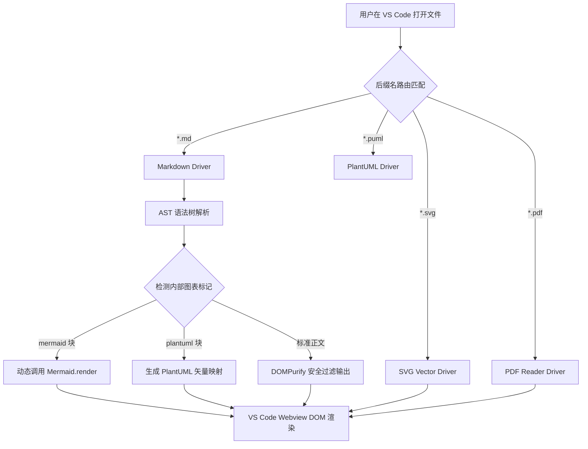
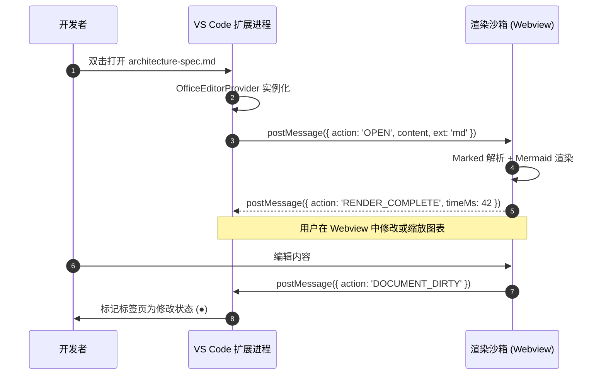
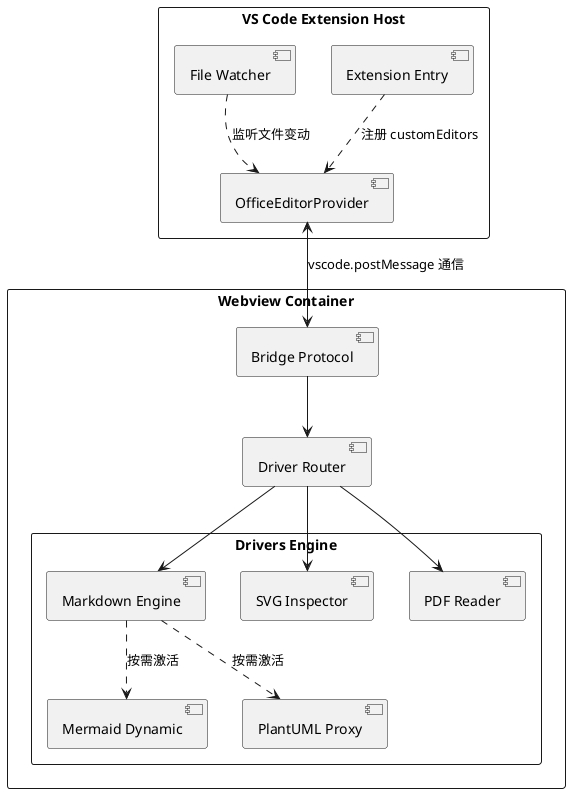

# OmniViewer 架构设计与规范说明书

> **版本**：v1.0.0 | **类型**：VS Code 扩展插件技术规格 | **授权**：100% 开源 (MIT)

OmniViewer 是一个面向 **Visual Studio Code** 的高扩展性多格式文件统一渲染引擎。本文档展示了 **Mermaid 流程图、时序图、PlantUML 架构图、矢量 SVG、数据表格与公式** 的无缝内嵌渲染效果。

---

## 一、核心特性矩阵

| 特性模块 | 支持能力 | 底层引擎 | 性能与包体积开销 |
| :--- | :--- | :--- | :--- |
| **Markdown** | GFM 标准、扩展语法、任务列表 | Marked + DOMPurify | < 120KB (极速即时解析) |
| **Mermaid** | 流程图、时序图、甘特图、状态图 | Mermaid.js 10+ | 按需动态载入 (Lazy Load) |
| **PlantUML** | 架构图、类图、组件图、用例图 | 官方/私有 SVG 渲染服务 | 毫秒级 URL 映射 |
| **SVG 矢量图**| 缩放平移、网格对齐、DOM 检查 | 原生 SVG 视口容器 | 零额外开销 |
| **PDF 预览** | 多页翻页、自适应缩放、大纲目录 | PDF.js / 矢量分页 | 隔离沙箱按需载入 |

---

## 二、Mermaid 流程图示例 (在线动态渲染)

以下为 VS Code 插件 Extension Host 与 Webview 沙箱的数据通信链路：



---

## 三、Mermaid 时序图示例 (双向通信机制)



---

## 四、PlantUML 架构组件图示例

在文档内直接书写 ```plantuml 代码块，OmniViewer 会自动将其编译为高清矢量图：



---

## 五、SVG 矢量图双模驱动渲染 (SVG Dual-Mode Driver)

OmniViewer 在 Markdown 中提供专业 SVG 矢量驱动支持：包含 **代码块实时编译** 与 **引用工作区本地矢量文件** 两种模式。

### 1. 模式一：```svg 原生代码块驱动渲染
支持在 Markdown 中直接撰写 ```svg 代码块，OmniViewer 会自动激活 SVG Driver，提供独立缩放、网格背景、源码切换与导出功能：

```svg
<svg width="100%" height="160" viewBox="0 0 760 160" xmlns="http://www.w3.org/2000/svg">
  <defs>
    <linearGradient id="cardGrad" x1="0%" y1="0%" x2="100%" y2="100%">
      <stop offset="0%" stop-color="#0f172a" />
      <stop offset="100%" stop-color="#1e293b" />
    </linearGradient>
    <linearGradient id="lineGrad" x1="0%" y1="0%" x2="100%" y2="0%">
      <stop offset="0%" stop-color="#06b6d4" />
      <stop offset="100%" stop-color="#10b981" />
    </linearGradient>
  </defs>

  <!-- Container Box -->
  <rect x="2" y="2" width="756" height="156" rx="12" fill="url(#cardGrad)" stroke="#334155" stroke-width="1.5"/>

  <!-- Pipeline Nodes -->
  <g transform="translate(30, 35)">
    <!-- Node 1 -->
    <rect x="0" y="10" width="130" height="70" rx="8" fill="#1e293b" stroke="#06b6d4" stroke-width="2"/>
    <text x="65" y="42" fill="#38bdf8" font-size="14" font-weight="bold" text-anchor="middle" font-family="system-ui">Marked AST</text>
    <text x="65" y="62" fill="#94a3b8" font-size="11" text-anchor="middle" font-family="system-ui">分词语法树解析</text>

    <!-- Arrow 1 -->
    <path d="M 135 45 L 185 45" stroke="url(#lineGrad)" stroke-width="2" marker-end="url(#arrow)" stroke-dasharray="4,4"/>
    <polygon points="185,41 195,45 185,49" fill="#10b981"/>

    <!-- Node 2 -->
    <rect x="200" y="10" width="140" height="70" rx="8" fill="#1e293b" stroke="#10b981" stroke-width="2"/>
    <text x="270" y="42" fill="#34d399" font-size="14" font-weight="bold" text-anchor="middle" font-family="system-ui">DOMPurify</text>
    <text x="270" y="62" fill="#94a3b8" font-size="11" text-anchor="middle" font-family="system-ui">SVG 白名单消毒</text>

    <!-- Arrow 2 -->
    <path d="M 345 45 L 395 45" stroke="#10b981" stroke-width="2" stroke-dasharray="4,4"/>
    <polygon points="395,41 405,45 395,49" fill="#a855f7"/>

    <!-- Node 3 -->
    <rect x="410" y="10" width="140" height="70" rx="8" fill="#1e293b" stroke="#a855f7" stroke-width="2"/>
    <text x="480" y="42" fill="#c084fc" font-size="14" font-weight="bold" text-anchor="middle" font-family="system-ui">SVG Inspector</text>
    <text x="480" y="62" fill="#94a3b8" font-size="11" text-anchor="middle" font-family="system-ui">无损视口缩放与平移</text>

    <!-- Arrow 3 -->
    <path d="M 555 45 L 605 45" stroke="#a855f7" stroke-width="2"/>
    <polygon points="605,41 615,45 605,49" fill="#3b82f6"/>

    <!-- Node 4 -->
    <rect x="620" y="10" width="80" height="70" rx="8" fill="#1e293b" stroke="#3b82f6" stroke-width="2"/>
    <text x="660" y="42" fill="#60a5fa" font-size="14" font-weight="bold" text-anchor="middle" font-family="system-ui">Webview</text>
    <text x="660" y="62" fill="#94a3b8" font-size="11" text-anchor="middle" font-family="system-ui">完美上屏</text>
  </g>
  <text x="40" y="140" fill="#64748b" font-size="11" font-family="system-ui">OmniViewer Pipeline Spec • 纯客户端零网络往返延迟 • 矢量无级放大</text>
</svg>
```

### 2. 模式二：引用工作区中的本地 SVG 文件
支持使用标准 Markdown 图片语法 `` 直接加载并渲染当前工作区中的矢量图纸：


---

## 六、工程开发任务检查清单

- [x] 完成多驱动架构 (Driver-based Plugin Architecture) 接口定义
- [x] 实现 Markdown GFM 规范与 Mermaid 10+ 异步渲染管线
- [x] 打通 PlantUML 在线与私有服务矢量编译
- [x] 实现 SVG 交互式视口检查器 (平移、缩放、网格标尺)
- [x] 实现高仿真多页 PDF 阅读器与翻页定位
- [ ] 发布 VS Code Marketplace 官方扩展插件包 (.vsix)
