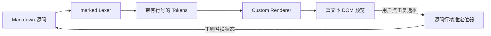

# GitHub 风格 Callout 提醒块与交互式任务清单

本文档用于演示 OmniView 全新升级的 **GitHub / Obsidian 规范 Callout 语义提醒块** 与 **交互式 Task List 双向回写** 特性。

---

## 一、GitHub / Obsidian 语义 Callout 提醒块

原生识别 Markdown 引用块中的 `[!TYPE]` 语义指令，渲染为带有专属高对比度左边框、彩色背景光晕与精致矢量图标的现代化卡片。

> [!NOTE]
> 这是标准的 **NOTE 备注卡片**。用于向读者补充说明上下文背景信息，保持主干逻辑清晰。

> [!TIP] 💡 核心开发技巧与最佳实践
> 这是带有**自定义标题**的 **TIP 技巧卡片**。在预览区直接点击任务清单的复选框，系统将通过 `data-task-line` 毫秒级双向回写源码，实现“所见即所点”。

> [!IMPORTANT]
> 这是 **IMPORTANT 重要提醒卡片**。包含关键业务规则或不可忽视的核心参数约束。

> [!WARNING]
> 这是 **WARNING 警告卡片**。在进行破坏性操作或跨版本升级前，请仔细核对依赖版本。

> [!CAUTION]
> 这是 **CAUTION 危险警示卡片**。未经授权的直接写库操作可能导致数据丢失或索引损坏。

### 支持折叠与展开的 Callout

使用 `[!TYPE]+`（默认展开）或 `[!TYPE]-`（默认折叠）即可轻松创建折叠手风琴块：

> [!NOTE]+ 详细实现机制剖析（默认展开，点击标题栏右侧箭头可折叠）
> OmniView 使用自定义 marked 渲染器拦截 `blockquote` 语法树，自动提取 `[!TYPE]` 标记，并将其转化为带有原生 `
` / `
` 的语义卡片。

> [!TIP]- 点击展开查看完整的快捷键支持列表（默认收起）
> - **Ctrl + S / ⌘ + S**：即时保存修改
> - **Ctrl + Z / ⌘ + Z**：撤销编辑
> - **双击正文**：精准定位并跳转到 VS Code 源码对应行号
> - **单击复选框**：实时切换任务状态并同步保存

---

## 二、交互式 Task List（复选清单）所见即所点

在右侧预览区直接点击下方的复选框，可体验**无缝交互**与**双向源码回写**：

### 🚀 阶段 1 & 2 交付清单
- [x] GitHub 风格 Callout 语义卡片（NOTE, TIP, IMPORTANT, WARNING, CAUTION）
- [x] 可选折叠展开语法（`[!NOTE]+` 与 `[!NOTE]-`）
- [x] 自定义 Callout 标题支持
- [x] 交互式 Task List 预览区直接点击勾选/取消勾选
- [x] 基于 `data-task-line` 精准反向定位与源码同步修改
- [ ] 导出 A4 物理分页打印配置面板
- [ ] 多文档批量关联分析与图谱导出

---

## 三、混合排版与图表内嵌

> [!NOTE] 架构拓扑说明
> 下图展示了从 Markdown 解析到 DOM 渲染及双向回写的完整数据流：

