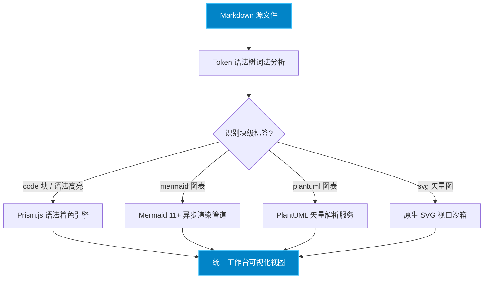
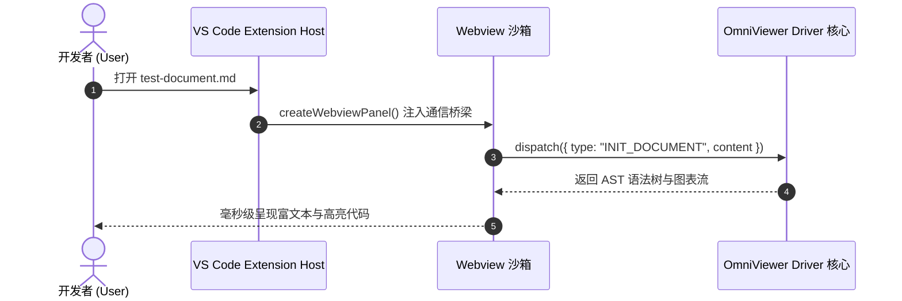
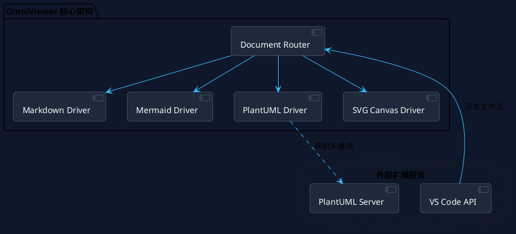

# OmniViewer Markdown 代码与全格式渲染能力验证规范

> **测试目标**：验证在 Markdown 文件中各类编程语言语法高亮、代码块交互工具条、Mermaid / PlantUML / SVG 图表内嵌与【预览 / 源码】双模切换、独立复制按钮以及 GFM 扩展排版的支持情况。

---

## 一、代码渲染支持矩阵与多语言语法高亮

OmniViewer 内置 Prism.js 语法分析驱动，为 Markdown 中的代码块提供 VS Code Dark+ 现代化暗色主题高亮、行号标尺、语言标识徽章以及一键独立复制代码的能力。

### 1. TypeScript / React (前端与插件内核)

```typescript
import { useState, useEffect, useMemo } from 'react';
import type { DriverContext, RenderResult } from '@omnivewer/core';

export interface CodeHighlightProps<T = string> {
  source: T;
  language: 'typescript' | 'python' | 'rust' | 'go';
  enableLineNumbers?: boolean;
  onCopySuccess?: (copiedText: string) => void;
}

export const useCodeRenderer = <T extends Record<string, unknown>>(
  context: DriverContext,
  initialPayload: T
): RenderResult<T> => {
  const [status, setStatus] = useState<'idle' | 'rendering' | 'ready'>('idle');

  useEffect(() => {
    const handleMessage = (event: MessageEvent) => {
      if (event.data?.type === 'DOM_READY') {
        setStatus('ready');
      }
    };
    window.addEventListener('message', handleMessage);
    return () => window.removeEventListener('message', handleMessage);
  }, []);

  return useMemo(() => ({ status, data: initialPayload }), [status, initialPayload]);
};
```

### 2. Python (后端算法与数据分析)

```python
import asyncio
from dataclasses import dataclass
from typing import AsyncGenerator, List, Optional

@dataclass(frozen=True)
class DocumentChunk:
    chunk_id: str
    token_count: int
    content: str
    metadata: Optional[dict] = None

class DocumentParserEngine:
    """高吞吐量异步文档切片与向量化解析引擎"""
    
    def __init__(self, model_name: str = "gemini-2.5-pro", batch_size: int = 64) -> None:
        self.model_name = model_name
        self.batch_size = batch_size
        self._cache = {}

    async def stream_parse(self, raw_text: str) -> AsyncGenerator[DocumentChunk, None]:
        lines: List[str] = [line.strip() for line in raw_text.splitlines() if line.strip()]
        for idx, line in enumerate(lines):
            await asyncio.sleep(0.01)  # 模拟非阻塞 I/O
            yield DocumentChunk(
                chunk_id=f"chunk-{idx:04d}",
                token_count=len(line.split()),
                content=line
            )

if __name__ == "__main__":
    parser = DocumentParserEngine()
    print(f"Initialized parser with model: {parser.model_name}")
```

### 3. Rust (高性能本地驱动模块)

```rust
use std::collections::HashMap;
use std::sync::{Arc, RwLock};

#[derive(Debug, Clone, PartialEq)]
pub enum DriverError {
    FileNotFound(String),
    CorruptedBuffer { bytes_read: usize, expected: usize },
    SandboxViolation,
}

pub struct MemoryCache<K, V> {
    storage: Arc<RwLock<HashMap<K, V>>>,
}

impl<K: std::hash::Hash + Eq + Clone, V: Clone> MemoryCache<K, V> {
    pub fn new() -> Self {
        Self {
            storage: Arc::new(RwLock::new(HashMap::new())),
        }
    }

    pub fn get_or_insert_with<F>(&self, key: K, factory: F) -> Result<V, DriverError>
    where
        F: FnOnce() -> Result<V, DriverError>,
    {
        if let Some(val) = self.storage.read().unwrap().get(&key) {
            return Ok(val.clone());
        }

        let new_value = factory()?;
        self.storage.write().unwrap().insert(key, new_value.clone());
        Ok(new_value)
    }
}
```

### 4. Go (微服务与并发任务调度)

```go
package main

import (
	"context"
	"fmt"
	"sync"
	"time"
)

type WorkerPool struct {
	concurrency int
	tasks       chan func(ctx context.Context) error
	wg          sync.WaitGroup
}

func NewWorkerPool(concurrency int) *WorkerPool {
	return &WorkerPool{
		concurrency: concurrency,
		tasks:       make(chan func(ctx context.Context) error, concurrency*4),
	}
}

func (wp *WorkerPool) Start(ctx context.Context) {
	for i := 0; i < wp.concurrency; i++ {
		wp.wg.Add(1)
		go func(workerID int) {
			defer wp.wg.Done()
			for {
				select {
				case <-ctx.Done():
					return
				case task, ok := <-wp.tasks:
					if !ok {
						return
					}
					if err := task(ctx); err != nil {
						fmt.Printf("[Worker %d] Task failed: %v\n", workerID, err)
					}
				}
			}
		}(i)
	}
}
```

### 5. SQL (分布式分析与窗口聚合)

```sql
-- 统计近 30 天每日活跃文档查看时长及 P95 分位数
WITH daily_session_stats AS (
    SELECT
        user_id,
        DATE(created_at) AS session_date,
        driver_id,
        duration_seconds,
        ROW_NUMBER() OVER(
            PARTITION BY user_id, DATE(created_at) 
            ORDER BY duration_seconds DESC
        ) as session_rank
    FROM omni_access_logs
    WHERE created_at >= NOW() - INTERVAL '30 days'
)
SELECT
    session_date,
    driver_id,
    COUNT(DISTINCT user_id) AS active_users,
    ROUND(AVG(duration_seconds), 2) AS avg_duration_sec,
    PERCENTILE_CONT(0.95) WITHIN GROUP (ORDER BY duration_seconds) AS p95_duration_sec
FROM daily_session_stats
WHERE session_rank <= 10
GROUP BY session_date, driver_id
HAVING COUNT(DISTINCT user_id) > 100
ORDER BY session_date DESC, active_users DESC;
```

### 6. Bash / Shell (自动化持续集成与部署)

```bash
#!/usr/bin/env bash
set -euo pipefail

echo "==> [1/3] 开始 VS Code 扩展插件源码构建环境检查..."
NODE_VERSION=$(node -v | cut -d'v' -f2)
REQUIRED_VERSION="18.0.0"

if [ "$(printf '%s\n' "$REQUIRED_VERSION" "$NODE_VERSION" | sort -V | head -n1)" != "$REQUIRED_VERSION" ]; then
    echo "错误：当前 Node.js 版本 $NODE_VERSION 低于要求版本 $REQUIRED_VERSION" >&2
    exit 1
fi

echo "==> [2/3] 编译 TypeScript 模块并生成 .vsix 安装包..."
npm run build
npx @vscode/vsce package --no-git-tag-version --out ./dist/omnivewer-latest.vsix

echo "==> [3/3] 打包产物校验完成：$(ls -lh ./dist/omnivewer-latest.vsix | awk '{print $5, $9}')"
```

### 7. JSON 与 YAML 配置规范

```json
{
  "omnivewer.drivers": {
    "markdown": { "enabled": true, "syntaxHighlightTheme": "tomorrow-night" },
    "mermaid": { "theme": "dark", "securityLevel": "loose", "zoomSpeed": 0.2 },
    "plantuml": { "serverUrl": "https://www.plantuml.com/plantuml", "renderFormat": "svg" }
  },
  "editor.fontSize": 14,
  "editor.lineNumbers": "on"
}
```

```yaml
name: Continuous Integration
on:
  push:
    branches: [ main, release/* ]
  pull_request:
    branches: [ main ]

jobs:
  build-and-test:
    runs-on: ubuntu-latest
    steps:
      - uses: actions/checkout@v4
      - name: Setup Node.js
        uses: actions/setup-node@v4
        with:
          node-version: '20.x'
          cache: 'npm'
      - run: npm ci
      - run: npm run test
```

### 8. Git 代码差异对比 (Diff)

```diff
Index: src/drivers/DriverHost.ts
===================================================================
--- src/drivers/DriverHost.ts (revision 102)
+++ src/drivers/DriverHost.ts (revision 103)
@@ -14,8 +14,9 @@
- const DEFAULT_TIMEOUT = 3000;
+ const DEFAULT_TIMEOUT = 5000;
+ const MAX_RETRY_ATTEMPTS = 3;

  export async function executeRender(doc: Document): Promise<RenderOutput> {
-   return localDriver.render(doc);
+   return fallbackManager.wrapWithRetry(() => localDriver.render(doc), MAX_RETRY_ATTEMPTS);
  }
```

---

## 二、图表渲染与【预览 / 源码】双模切换及独立复制

在以下图表卡片中，您可以：
1. 点击右上角 **【源码】** 按钮：直接查看原始图表代码，并支持**在线编辑**；
2. 编辑完成后点击 **【应用并渲染】**：观察图表实时编译更新；
3. 点击独立专属的 **【复制】** 按钮：直接将图表源码拷贝到剪贴板，带有即时反馈。

### 1. Mermaid 异步动态流程图



### 2. Mermaid 时序交互图



### 3. PlantUML 架构组件图



### 4. SVG 矢量图驱动 (代码块驱动)

```svg
<svg xmlns="http://www.w3.org/2000/svg" viewBox="0 0 540 120" width="100%" height="120">
  <defs>
    <linearGradient id="demoGrad" x1="0%" y1="0%" x2="100%" y2="100%">
      <stop offset="0%" stop-color="#3b82f6" />
      <stop offset="50%" stop-color="#8b5cf6" />
      <stop offset="100%" stop-color="#06b6d4" />
    </linearGradient>
    <filter id="shadow" x="-10%" y="-10%" width="120%" height="120%">
      <feDropShadow dx="0" dy="4" stdDeviation="6" flood-color="#0284c7" flood-opacity="0.3"/>
    </filter>
  </defs>
  <rect x="10" y="10" width="520" height="100" rx="16" fill="#1e293b" stroke="#334155" stroke-width="2" filter="url(#shadow)"/>
  <circle cx="55" cy="60" r="28" fill="url(#demoGrad)" />
  <path d="M45 60 L52 67 L68 51" stroke="#ffffff" stroke-width="4" stroke-linecap="round" stroke-linejoin="round" fill="none"/>
  <text x="100" y="52" fill="#f8fafc" font-size="16" font-family="system-ui, sans-serif" font-weight="bold">OmniViewer 矢量渲染核心引擎已就绪</text>
  <text x="100" y="76" fill="#94a3b8" font-size="12" font-family="system-ui, sans-serif">支持代码块定义与工作区文件引用两种链接模式</text>
</svg>
```

---

## 三、GFM 扩展排版规范与样式验证

### 1. 任务列表 (Task Checkboxes)

- [x] 多语言语法着色驱动接入 (Prism.js + Tomorrow Night 主题)
- [x] 代码块专用工具条：语言角标、代码行数统计、独立一键复制
- [x] Mermaid / PlantUML / SVG 图表【预览 / 源码】无缝切换
- [x] 图表源码模式下支持在线实时修改并重新编译渲染
- [x] 分离“复制”功能为独立操作按钮，消除模式混淆
- [ ] 离线局域网私有 PlantUML Server 本地容器直连

### 2. 对齐表格格式 (GFM Tables)

| 功能特性 | 触发语法 / 拓展名 | 默认视图模式 | 源码编辑支持 | 复制操作按钮 |
| :--- | :---: | :---: | :---: | :--- |
| **代码高亮** | ```ts / ```py / ```rs | 代码卡片 | 原生编辑器 | 独立复制按钮（带勾选动画） |
| **Mermaid** | ```mermaid | 可视化图表 | 支持在线双向编辑 | 独立复制源码按钮 |
| **PlantUML** | ```plantuml 或 .puml | 矢量渲染图 | 支持在线双向编辑 | 独立复制源码按钮 |
| **SVG 矢量图**| ```svg 或 .svg | 矢量沙箱 | 支持在线编辑 XML | 独立复制 XML 按钮 |
| **行内代码** | `const val = 1` | 高亮药丸徽章 | 行内文本编辑 | 随文本跟随复制 |

### 3. 引用提示卡片 (Callout Quotes)

> **💡 研发提示 (Tip)**：
> 在 Markdown 中不仅可以使用标准代码块，还可以直接通过 `` 引用同工作区内的任意 SVG 文件，OmniViewer 均会自动激活矢量驱动并提供缩放、网格和源码切换！

> **⚠️ 安全规范 (Security Note)**：
> 所有动态插入的 HTML 与 SVG 均经过严格沙箱隔离与 DOMPurify 净化，防范 XSS 攻击与脚本注入风险。
