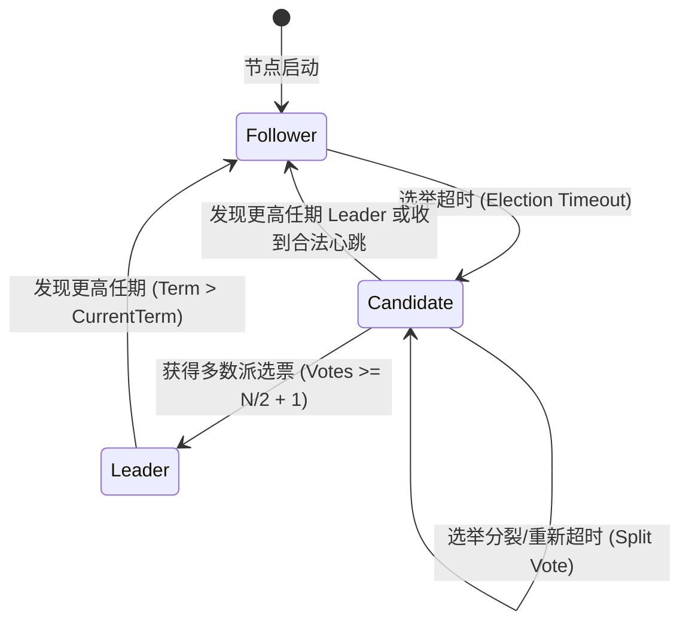
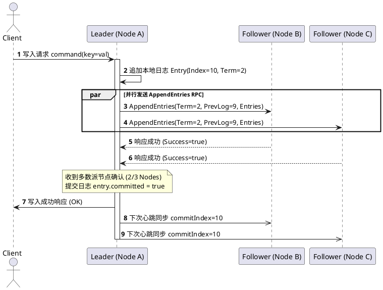
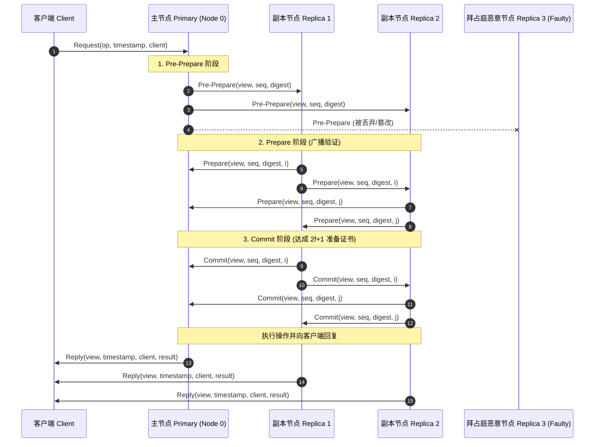

# 分布式共识机制与算法架构示例 (Distributed Consensus Algorithms)

本文档全面介绍经典分布式系统中的核心共识协议（Consensus Protocols），包含 **Raft**、**PBFT (Practical Byzantine Fault Tolerance)**、**Paxos** 以及区块链 **PoW / PoS** 共识机制。结合 **Mermaid 架构图**、**PlantUML 时序交互** 与 **KaTeX 数学证明公式** 呈现。

---

## 1. 分布式共识基础理论

### 1.1 FLP 不可能定理与 CAP 定理
在异步网络通信模型中，如果存在哪怕单个节点可能发生崩溃故障（Crash Fault），则不存在任何确定性的共识算法能够同时保证：
1. **安全性 (Safety / Agreement)**：所有非拜占庭正确节点决策出相同的值。
2. **活性 (Liveness / Termination)**：所有正确节点最终都能完成决策。

CAP 定理表明在分布式数据存储系统中：
$$\text{Consistency} \cap \text{Availability} \cap \text{Partition Tolerance} = \emptyset \implies \text{至多同时满足其中两项}$$

---

## 2. Raft 共识算法

Raft 通过将共识问题分解为 **Leader 选举 (Leader Election)**、**日志复制 (Log Replication)** 和 **安全性 (Safety)** 三个子问题来实现易理解与工程化落地。

### 2.1 节点角色转换状态机

### 2.2 Leader 选举与日志追加时序 (PlantUML)

### 2.3 多数派法定人数数学约束 (Quorum)

对于包含 $N$ 个节点的集群，要容忍至多 $f$ 个节点发生崩溃故障（非拜占庭）：
$$N \ge 2f + 1 \iff f \le \left\lfloor \frac{N - 1}{2} \right\rfloor$$

法定多数派仲裁集合大小满足：
$$|Q_1 \cap Q_2| \ge 1 \quad \forall Q_1, Q_2 \subseteq \mathcal{N} \quad \text{where } |Q_i| = \left\lfloor \frac{N}{2} \right\rfloor + 1$$

---

## 3. PBFT 拜占庭容错共识算法

PBFT 能够在存在恶意节点（伪造消息、女巫攻击、双花攻击）的异步网络中达成共识。

### 3.1 拜占庭容错节点数边界

若网络中存在 $f$ 个恶意拜占庭节点，要确保系统安全性和活性，总节点数 $R$ 必须满足：
$$R \ge 3f + 1$$

其证明逻辑为：总节点 $R$ 减去无响应的 $f$ 个节点，在剩下的 $R - f$ 个响应中，可能包含 $f$ 个恶意伪造消息，因此正确节点数必须严格大于恶意节点数：
$$(R - f) - f > f \iff R \ge 3f + 1$$

### 3.2 PBFT 三阶段提交时序图

---

## 4. 区块链与密码学共识模型

### 4.1 PoW 工作量证明 (Proof of Work)

矿工通过遍历随机数 $\text{nonce}$ 寻找满足目标哈希难度约束的解：
$$\text{SHA256}(\text{SHA256}(\text{BlockHeader} \parallel \text{nonce})) < \text{Target}(D)$$

目标难度阈值与目标哈希前导零关系：
$$\text{Target} = \text{Target}_{\text{max}} \times 2^{-\text{Difficulty}}$$

期望哈希计算次数与泊松到达过程：
$$\mathbb{E}[\text{Hashes}] = \frac{2^{256}}{\text{Target}}, \quad P(N(t) = k) = \frac{(\lambda t)^k e^{-\lambda t}}{k!}$$

### 4.2 PoS 权益证明与无利害关系防御 (Proof of Stake)

在基于链的 PoS 中，验证者中选出块概率与其质押代币权益（Stake）成正比：
$$P(\text{Validator } i \text{ elected}) = \frac{S_i}{\sum_{j=1}^M S_j}$$

Slashing 惩罚函数（对于双重签名或分叉投票恶意行为）：
$$\text{Penalty}(i) = \min\left(S_i, \; S_i \cdot \alpha \sum_{\text{equivocators}} S_k \right)$$

---

## 5. 经典共识协议特性对比矩阵

| 协议名称 | 容错模型 | 容错上限 | 通信复杂度 | 吞吐量 (TPS) | 最终一致性确认延迟 |
|---|---|---|---|---|---|
| **Paxos** | Crash Fault (非拜占庭) | $f < N/2$ | $\mathcal{O}(N)$ | 高 (~10,000) | 毫秒级 (~10ms) |
| **Raft** | Crash Fault (非拜占庭) | $f < N/2$ | $\mathcal{O}(N)$ | 高 (~10,000) | 毫秒级 (~10ms) |
| **PBFT** | Byzantine Fault (拜占庭) | $f < N/3$ | $\mathcal{O}(N^2)$ | 中等 (~1,000) | 秒级 (~1s) |
| **PoW (BTC)** | Nakamoto (拜占庭) | $f < 50\%$ 算力 | $\mathcal{O}(N)$ (Gossip) | 极低 (~7) | 约 60 分钟 (6 确认) |
| **PoS (ETH 2.0)** | Casper FFG (拜占庭) | $f < 1/3$ 质押量 | $\mathcal{O}(N)$ (BLS 聚合) | 中高 (~100+) | 约 12-15 分钟 (2 Epoch) |
