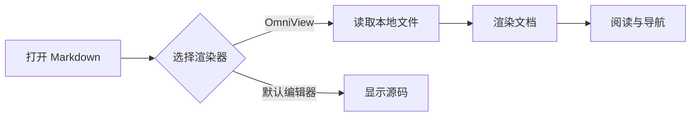
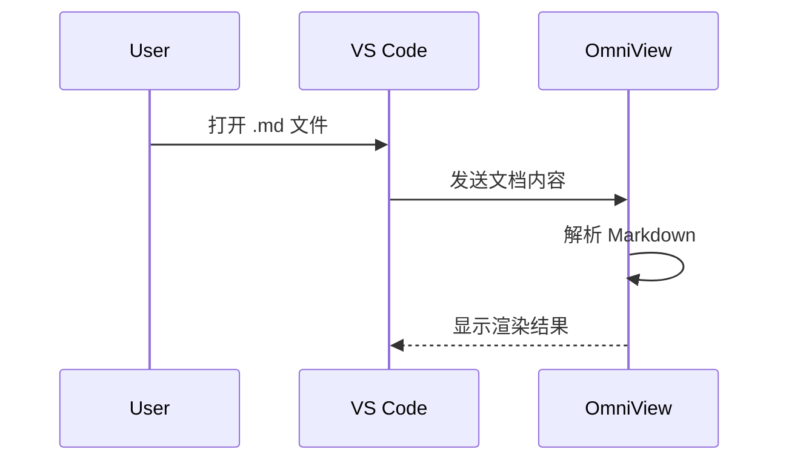
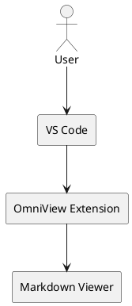
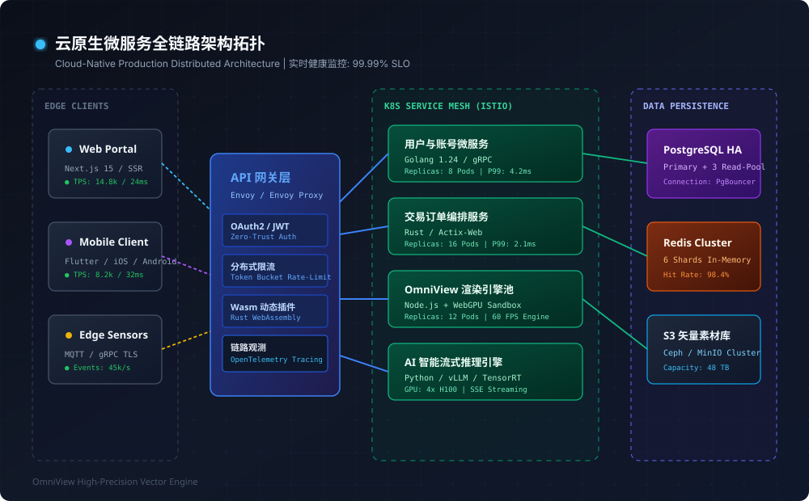
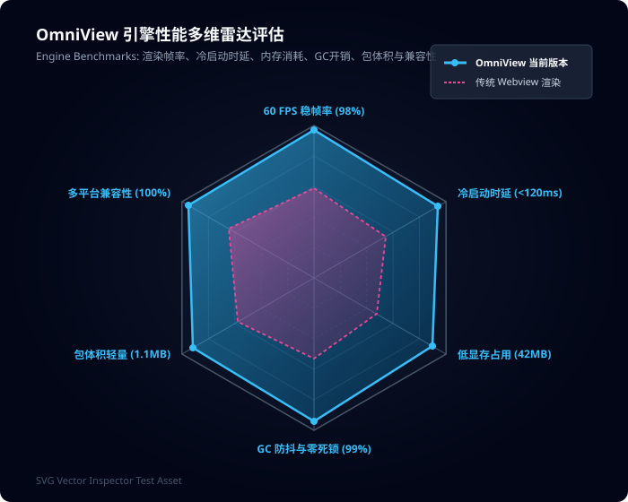
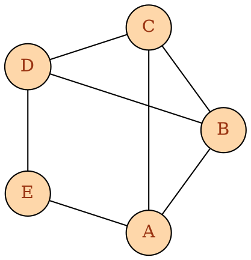

# 图表渲染示例

下面的图表用于验证 Markdown 中的 Mermaid 和 PlantUML 代码块。图表可以在预览和源码模式之间切换。

## Mermaid 流程图



## Mermaid 时序图



## PlantUML 组件图



## SVG 矢量图渲染示例

在 Markdown 文档中支持直接通过 \`\`\`svg 代码块内联渲染交互式矢量图形，支持在【预览/源码】之间切换编辑，以及下载 SVG：

```svg
<svg xmlns="http://www.w3.org/2000/svg" viewBox="0 0 600 180" width="100%" height="180">
  <defs>
    <linearGradient id="flowGrad" x1="0%" y1="0%" x2="100%" y2="0%">
      <stop offset="0%" stop-color="#3b82f6" />
      <stop offset="50%" stop-color="#8b5cf6" />
      <stop offset="100%" stop-color="#ec4899" />
    </linearGradient>
  </defs>
  <rect width="600" height="180" rx="10" fill="#0f172a" stroke="#334155" stroke-width="1.5" />
  <g transform="translate(30, 40)">
    <rect width="140" height="70" rx="8" fill="#1e293b" stroke="#3b82f6" stroke-width="2" />
    <text x="70" y="32" fill="#f8fafc" font-size="13" font-weight="700" text-anchor="middle">文件输入流</text>
    <text x="70" y="52" fill="#94a3b8" font-size="10" font-family="monospace" text-anchor="middle">.md / .puml / .svg</text>
  </g>
  <path d="M 180 75 L 220 75" stroke="url(#flowGrad)" stroke-width="3" stroke-linecap="round" marker-end="url(#arrow)" />
  <g transform="translate(230, 40)">
    <rect width="140" height="70" rx="8" fill="#1e293b" stroke="#8b5cf6" stroke-width="2" />
    <text x="70" y="32" fill="#f8fafc" font-size="13" font-weight="700" text-anchor="middle">OmniView 引擎</text>
    <text x="70" y="52" fill="#c084fc" font-size="10" font-family="monospace" text-anchor="middle">AST + WebGPU</text>
  </g>
  <path d="M 380 75 L 420 75" stroke="url(#flowGrad)" stroke-width="3" stroke-linecap="round" />
  <g transform="translate(430, 40)">
    <rect width="140" height="70" rx="8" fill="#1e293b" stroke="#ec4899" stroke-width="2" />
    <text x="70" y="32" fill="#f8fafc" font-size="13" font-weight="700" text-anchor="middle">沉浸式渲染视口</text>
    <text x="70" y="52" fill="#f472b6" font-size="10" font-family="monospace" text-anchor="middle">60 FPS 交互</text>
  </g>
  <text x="30" y="150" fill="#64748b" font-size="11">SVG 内嵌矢量驱动验证 | </text>
</svg>
```

## 本地 SVG 引用渲染

- [云原生微服务拓扑图 (SVG)](./../svg/microservices-cloud-topology.svg)
- [性能多维雷达评估图 (SVG)](./../svg/performance-radar-chart.svg)





## Graphviz / DOT 矢量拓扑图

在 Markdown 中支持直接嵌入 ````dot```` 或 ````graphviz```` 代码块，通过 Web Worker + WASM 异步进行高精度矢量排版：




## 图表阅读建议

当图表内容较宽时，可以使用图表工具栏中的缩放按钮或直接双击画布进入全屏灯箱；需要修改语法时切换到源码模式，应用后即可重新渲染。


