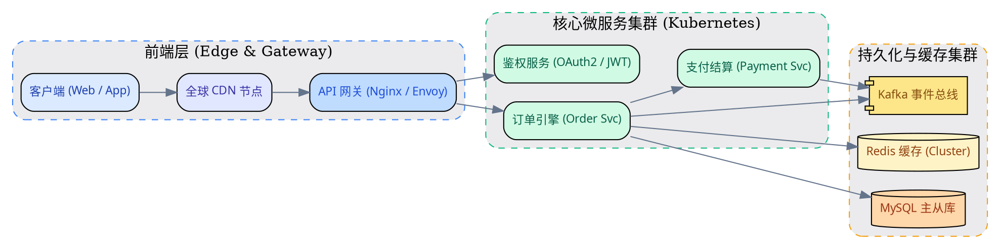
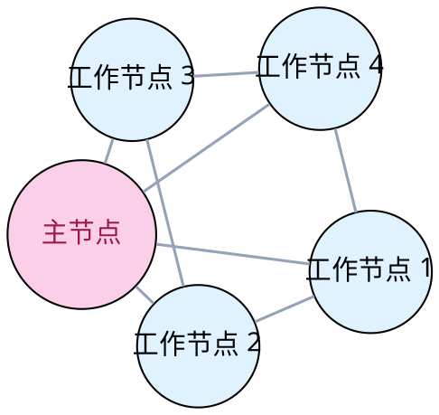
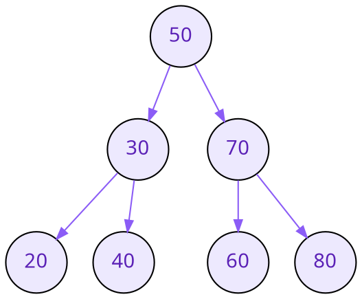

# Graphviz / DOT 架构图与拓扑可视化示例

本文档全面展示 OmniView 对 **Markdown 内嵌 Graphviz / DOT 矢量图表** 的渲染能力。支持 ````dot```` 与 ````graphviz```` 语法块、Web Worker 异步 WASM 编译、DOMPurify 安全清洗、全屏灯箱放大、缩放平移与源码在线编辑。

---

## 1. 经典服务架构有向图 (```dot)



---

## 2. 状态机与网络拓扑无向图 (```graphviz)



---

## 3. 数据结构二叉搜索树 (```dot)



---

## 4. 容错与错误边界测试 (错误语法降级)

以下为一个包含故意的语法损坏的 DOT 代码块，用于验证局部错误诊断与降级能力（绝不白屏，提供源码编辑与错误详情一键复制）：

```dot
digraph BrokenSyntaxDemo {
  A ->
}
```
