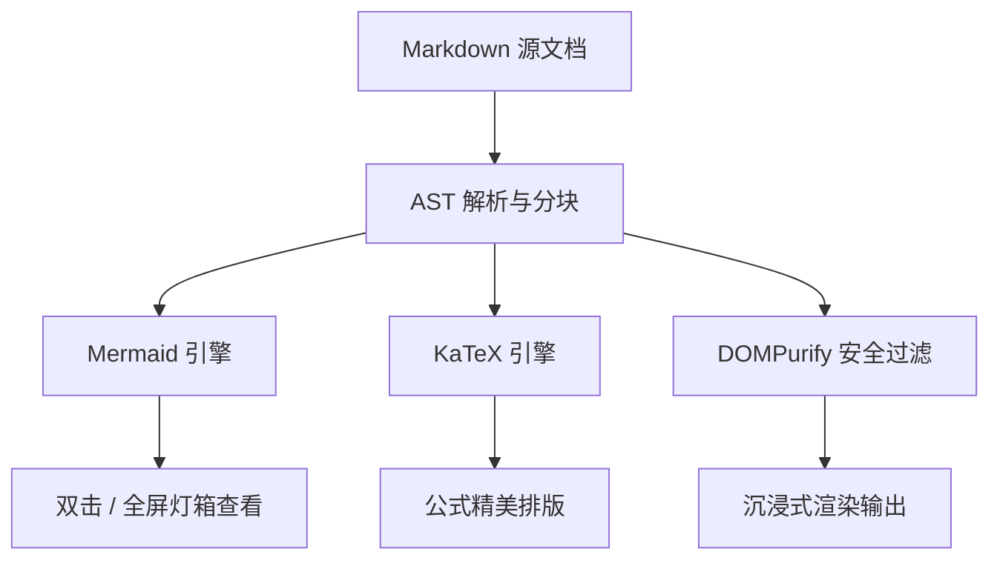
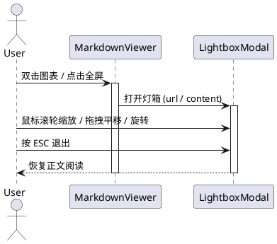

# KaTeX 数学公式与图表灯箱测试案例

本文档用于验证 OmniView 的 **KaTeX 数学公式渲染**、**图片灯箱沉浸式浏览** 以及 **图表全屏/双击灯箱查看** 功能。

---

## 1. KaTeX 数学公式渲染测试

### 1.1 行内数学公式 (Inline Math)
- 质能方程：$E = mc^2$ 是现代物理学的基石。
- 欧拉恒等式：$e^{i\pi} + 1 = 0$ 被誉为数学中最优美的公式。
- 二次方程求根公式：对于方程 $ax^2 + bx + c = 0$，其解为 $x = \frac{-b \pm \sqrt{b^2 - 4ac}}{2a}$。
- 货币符号防误触测试：商品 A 原价 $100，现打折销售 $50，不应被识别为公式。

### 1.2 块级数学公式 (Block Math `$$ ... $$`)
高斯积分公式：
$$\int_{-\infty}^{+\infty} e^{-x^2} dx = \sqrt{\pi}$$

麦克斯韦方程组（微分形式）：
$$\begin{aligned}
\nabla \cdot \mathbf{E} &= \frac{\rho}{\varepsilon_0} \\
\nabla \cdot \mathbf{B} &= 0 \\
\nabla \times \mathbf{E} &= -\frac{\partial \mathbf{B}}{\partial t} \\
\nabla \times \mathbf{B} &= \mu_0 \left(\mathbf{J} + \varepsilon_0 \frac{\partial \mathbf{E}}{\partial t}\right)
\end{aligned}$$

### 1.3 代码块数学公式 (```math / ```katex / ```latex)

```math
f(x) = \sum_{n=0}^{\infty} \frac{f^{(n)}(a)}{n!} (x - a)^n
```

```katex
\mathcal{L}\{\dot{f}(t)\} = s F(s) - f(0^-)
```

```latex
\lim_{x \to 0} \frac{\sin x}{x} = 1
```

---

## 2. 图表全屏与双击灯箱交互测试

> **测试说明**：
> 1. 可以点击卡片右上角工具栏中的 **全屏放大按钮** 唤起灯箱。
> 2. 可以直接 **双击图表画布** 唤起沉浸式灯箱。
> 3. 在灯箱中支持 **鼠标滚轮无级缩放**、**鼠标拖拽平移**、**旋转 90°**、**复制/下载** 与 `Esc` 退出。

### 2.1 Mermaid 架构图



### 2.2 PlantUML 时序图



### 2.3 SVG 矢量图代码块

```svg
<svg xmlns="http://www.w3.org/2000/svg" viewBox="0 0 400 160" width="100%" height="160">
  <defs>
    <linearGradient id="grad1" x1="0%" y1="0%" x2="100%" y2="100%">
      <stop offset="0%" style="stop-color:#3b82f6;stop-opacity:1" />
      <stop offset="100%" style="stop-color:#8b5cf6;stop-opacity:1" />
    </linearGradient>
  </defs>
  <rect x="20" y="20" width="360" height="120" rx="16" fill="url(#grad1)" stroke="#60a5fa" stroke-width="2" />
  <text x="200" y="70" fill="#ffffff" font-size="18" font-weight="bold" text-anchor="middle" font-family="sans-serif">OmniView Lightbox & KaTeX</text>
  <text x="200" y="105" fill="#e0e7ff" font-size="12" text-anchor="middle" font-family="sans-serif">双击此矢量图即可进入全屏灯箱缩放与平移模式</text>
</svg>
```

---

## 3. 图片灯箱测试

点击下方图片（或本地相对路径图片）均可直接触发灯箱：


