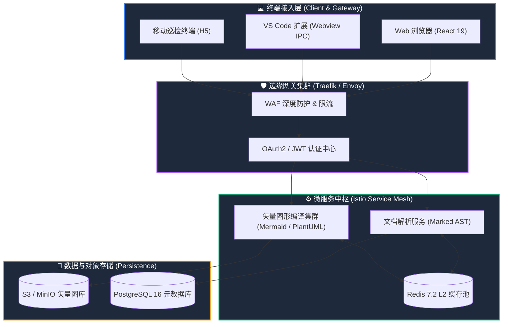
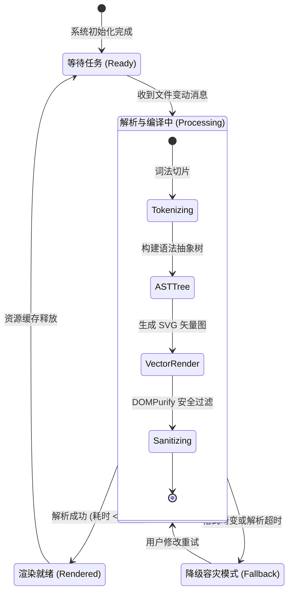
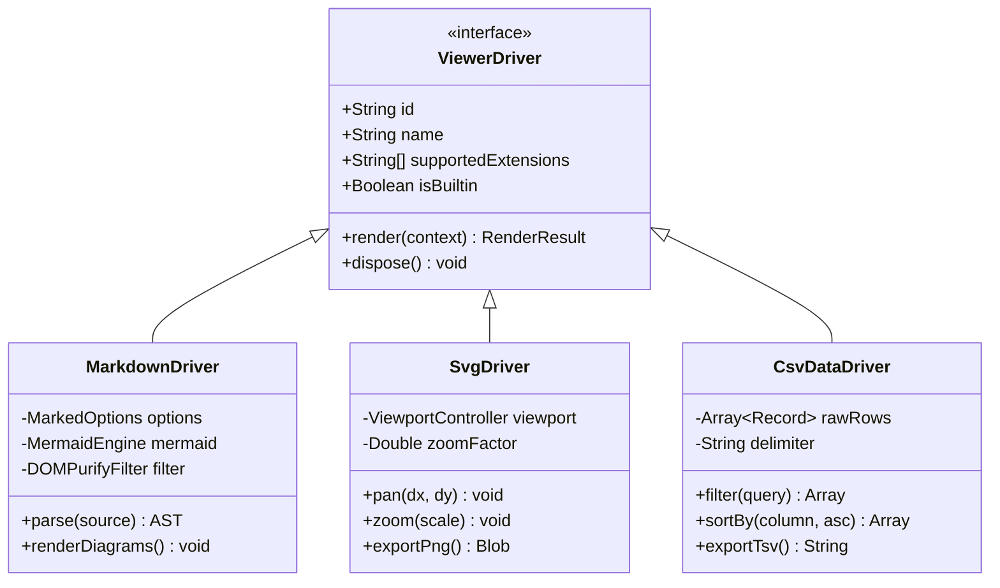
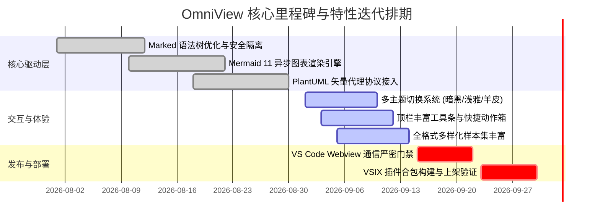
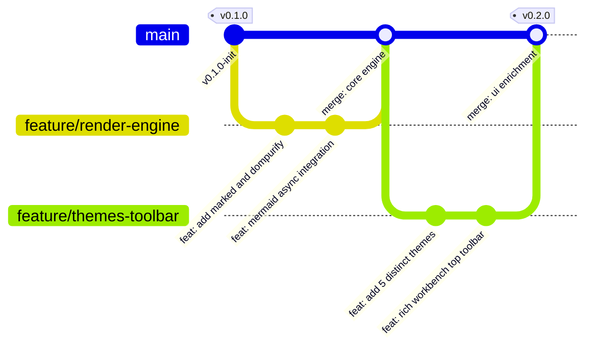
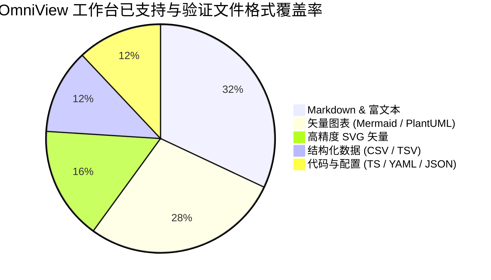

# Mermaid 动态图表全景展馆 (Mermaid Visual Gallery)

> **引擎版本**：Mermaid.js v11+ | **渲染驱动**：OmniView Markdown & Diagram Engine | **作者**

本文档全面演示 OmniView 渲染引擎对 **Mermaid** 丰富图表类型的解析能力，包含 **流程图、时序图、类图、状态机、甘特图、Git 工作流图与数据占比饼图**。支持暗色/亮色多主题自适应渲染！

---

## 1. 复杂带分组与样式流程图 (Flowchart with Subgraphs)

---

## 2. 状态机图 (State Diagram v2)

---

## 3. 面向对象类图 (Class Diagram)

---

## 4. 研发甘特图 (Gantt Project Timeline)

---

## 5. 软件工程 Git 工作流图 (GitGraph)

---

## 6. 文件格式支持占比饼图 (Pie Chart)

