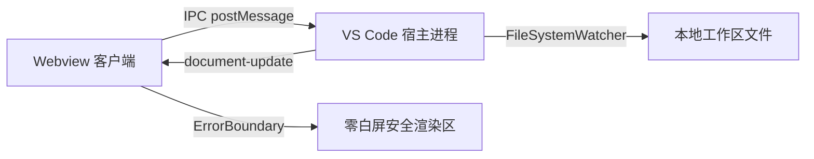

# OmniView 稳定性与极限压力测试用例

> ****  
> 本文档包含极限超宽表格、缺失图片、语法损坏图表与长文档测试，用于验证渲染错误边界与资源隔离能力。

---

## 1. 语法损坏的 Mermaid 图表 (验证错误边界与诊断卡片)

以下是一个故意的语法损坏图表，验证错误边界是否能捕获并优雅降级，且**绝不导致整页白屏**：

```mermaid
graph TD
  A[服务注册中心] --> B(网关集群
  B --- C{损坏的语法分支
```

---

## 2. 相对路径图片诊断测试 (验证缺失资源占位卡)

以下引用一个不存在的本地图片文件，验证是否展现优雅的缺失路径诊断占位卡：


---

## 3. 极限超宽 20 列数据表格测试 (验证 .ov-table-wrapper 横向自适应滚动)

| 节点ID | 主机名 | IP地址 | 状态 | CPU使用率 | 内存分配 | 磁盘I/O | 网络吞吐 | Pods数量 | 容器引擎 | 内核版本 | 区域 | 可用区 | 机架 | 负载均衡器 | 安全组 | 备份状态 | 监控告警 | 标签 | 描述信息 |
|---|---|---|---|---|---|---|---|---|---|---|---|---|---|---|---|---|---|---|---|
| node-001 | k8s-master-prod-01 | 10.240.1.11 | Running | 24.5% | 16.2 GB / 32 GB | 145 MB/s | 1.2 Gbps | 42 | Containerd 1.7 | Linux 6.8.0 | cn-north | zone-a | rack-102 | alb-ingress-01 | sg-prod-core | Completed | Normal | env=prod,role=master | 核心集群控制平面主节点 01 |
| node-002 | k8s-worker-prod-02 | 10.240.1.12 | Running | 78.2% | 60.1 GB / 64 GB | 890 MB/s | 9.4 Gbps | 118 | Containerd 1.7 | Linux 6.8.0 | cn-north | zone-a | rack-102 | alb-ingress-01 | sg-prod-worker | Completed | HighLoad | env=prod,role=worker | 高并发计算工作节点 02 |
| node-003 | k8s-worker-prod-03 | 10.240.1.13 | Running | 62.1% | 45.8 GB / 64 GB | 540 MB/s | 6.8 Gbps | 96 | Containerd 1.7 | Linux 6.8.0 | cn-north | zone-b | rack-104 | alb-ingress-02 | sg-prod-worker | Completed | Normal | env=prod,role=worker | 高并发计算工作节点 03 |
| node-004 | db-cluster-primary | 10.240.2.20 | Healthy | 45.0% | 120 GB / 256 GB | 1.8 GB/s | 4.2 Gbps | 1 | Native PG 16 | Linux 6.8.0 | cn-north | zone-a | rack-201 | - | sg-prod-db | Synced | Normal | env=prod,role=db | 核心主数据库实例 |

---

## 4. 正常 Mermaid 架构图 (验证多图表共存与隔离)



---

## 5. 超长文本与层级压力测试

### 5.1 第一阶段：生命周期与资源调度
在长文档浏览过程中，滚动性能、内存占用与 DOM 节点回收需保持 60 FPS 稳定帧率。

### 5.2 第二阶段：双向通信与状态同步
文档热重载机制通过 VS Code 文件系统观察者即时捕获改动，并以原子化数据包通知 Webview 渲染管道，避免破坏用户当前的阅读位置与大纲状态。

### 5.3 第三阶段：防腐与防御性设计
每一个独立的数据驱动块（包含 Mermaid、PlantUML、SVG、代码块）均处于隔离的渲染错误边界保护中，任何未预期的异常均被局限在当前区域内。
