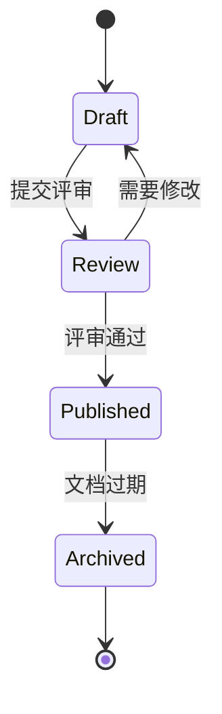

# 本地文档预览指南

## 目标

这是一份模拟真实项目 README 的综合样例，用于观察长文档中的导航、代码、表格、引用和图表是否协同工作。

## 快速开始

```bash
git clone https://example.com/omniview.git
cd omniview
npm install
npm run dev
```

## 文档生命周期



## 配置参考

| 配置项 | 类型 | 默认值 | 用途 |
| --- | --- | --- | --- |
| `theme` | string | `dark` | 阅读器主题 |
| `outline` | boolean | `true` | 是否显示左侧大纲 |
| `zoom` | number | `1` | 初始阅读缩放 |

## 注意事项

> 本地文件中的图片和相对路径资源需要位于 VS Code 可访问的工作区内。

长文档建议使用清晰的二级和三级标题组织内容。打开大纲后，可以快速判断文档结构，也能在章节之间移动。

## 验收清单

- [x] 顶部工具栏可用
- [x] 左侧标题导航可用
- [x] 长文档可以垂直滚动
- [x] 代码块可以复制
- [x] Mermaid 和 PlantUML 可以渲染
