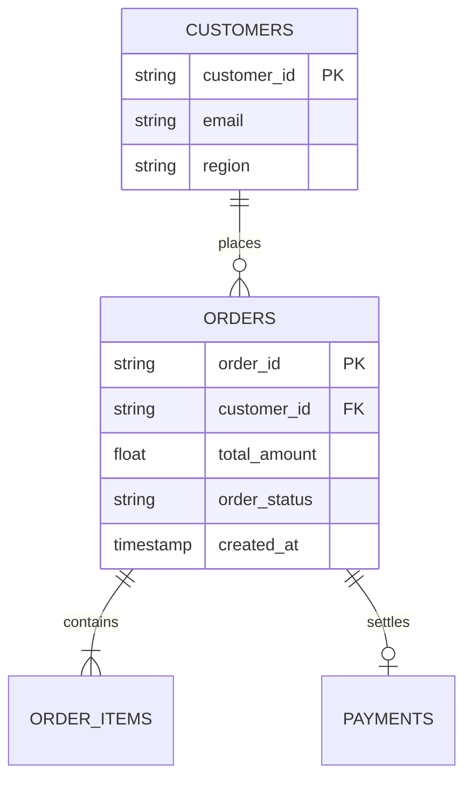

# 📦 电商订单数据字典 (Orders Concept)

> **Google OKF (Open Knowledge Format) 规范展示**：
> 本文档是基于 Google Cloud 官方倡导的 OKF v0.1 规范编写的概念节点。
> 顶部元数据已被结构化解析为实体卡片，包含类型、Tags 标签胶囊、外部链接及审计时间戳。

---

## 1. 字段架构与字典定义 (Schema)

| 字段名称 (Column) | 数据类型 (Type) | 模式 (Mode) | 语义说明与外键关联 (Description) | 示例取值 |
| :--- | :---: | :---: | :--- | :--- |
| `order_id` | `STRING` | REQUIRED | 全局唯一订单流水号，分布式雪花算法生成 | `ORD-202606-9812` |
| `customer_id` | `STRING` | REQUIRED | 客户主体外键，关联 [customers](/workspace/sales/tables/customers.okf.md) 概念 | `CUST-88391` |
| `total_amount` | `FLOAT64` | REQUIRED | 订单折后实际结算金额（单位：美元） | `249.99` |
| `currency` | `STRING` | REQUIRED | ISO 4217 结算货币代码 | `USD` |
| `order_status` | `STRING` | REQUIRED | 状态机枚举：`PENDING`、`PAID`、`SHIPPED`、`DELIVERED` | `PAID` |
| `created_at` | `TIMESTAMP` | REQUIRED | 订单创建 UTC 时间戳，分区键字段 | `2026-06-12 09:30:15` |

---

## 2. 实体关系与拓扑图谱 (Entity Relationships)

通过标准 Markdown 链接与 Mermaid，表达该表在数据仓库中的上下游拓扑：

---

## 3. 关联拓扑与指标应用 (Joins & Lineage)

- **客户主表关联**：通过 `customer_id` 与 [customers.okf.md](/workspace/sales/tables/customers.okf.md) 进行一对多关联。
- **业务指标支持**：本表作为底层事实输入，直接用于计算周活跃指标 [weekly_active_users.okf.md](/workspace/sales/metrics/weekly_active_users.okf.md)。
